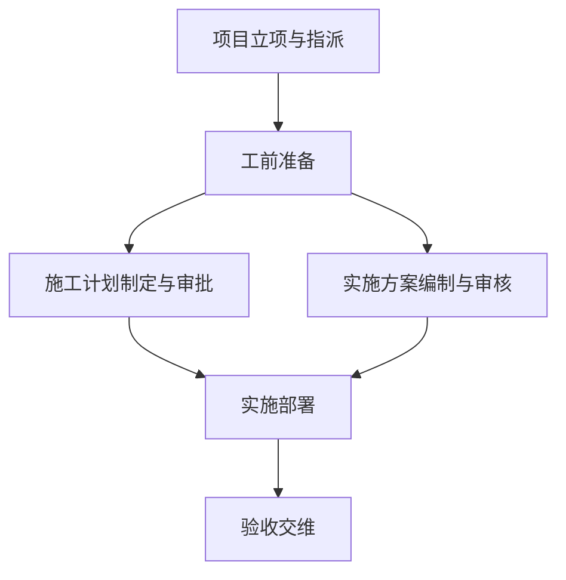
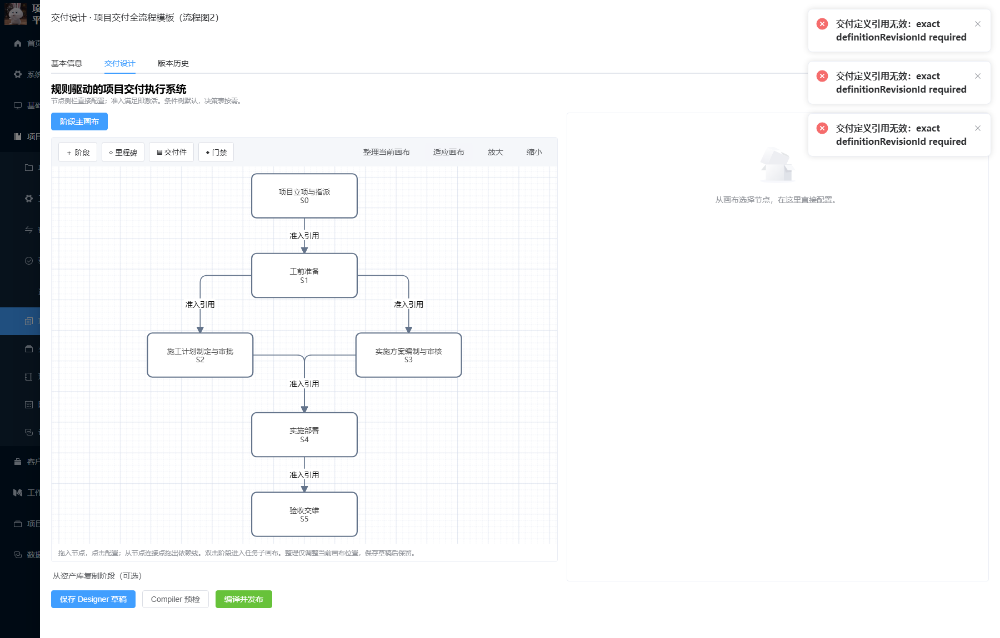
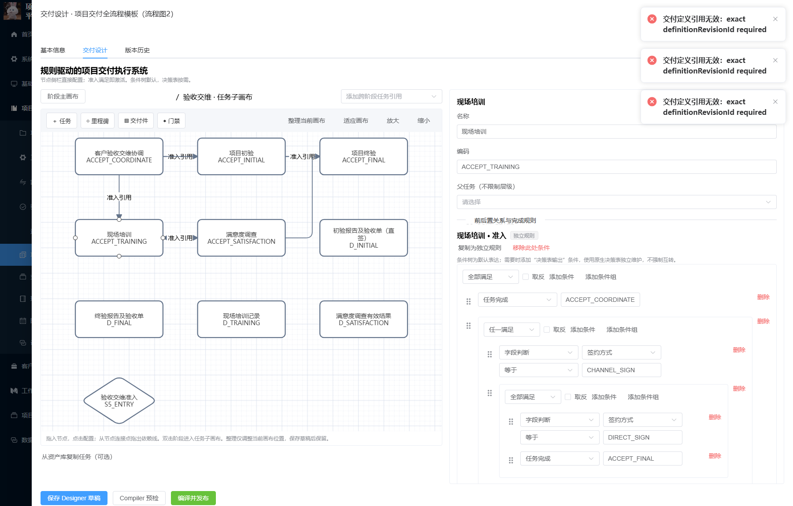
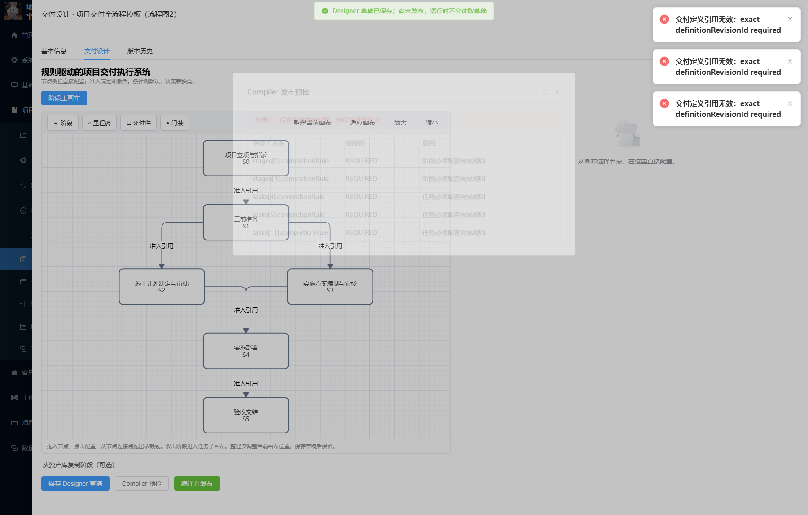

# 流程图项目模板配置记录

> 最终状态（2026-09-24）：模板已发布至 rev9 并完成两条路径（直签 028 / 渠道 032）S0～S5 真实项目验收，含割接过渡审批、满意度链与本轮缺陷修复披露。当前结论以 [发布与全链验收记录](acceptance/README.md) 为准；本页及以下历史记录保留首次配置时点证据。

> 当前结果：历史工前确认模块已从应用代码剔除，工前输入统一使用原工勘记录；模板 V16 / DRAFT、预检通过。见 [最新移除验证](confirmation-code-removal.json) 和 [工勘来源更正](survey-source/README.md)；其他记录保留历史回执含义。

> 后续接入：人员指派、施工计划审批、普通方案审核与割接完成已接入，规则字段改为实体自动发现和参数管理；当前状态及验证见 [接入增量记录](integration/README.md)。下文保留首次配置时的原始证据。

> 生成记录，不是新的 PRD、SDS 或 Feature 完成证明。

**结果：新模板已保存并完成配置读写验证，状态为 DRAFT，尚不可发布或用于新项目匹配。完整可运行模板的目标尚未达成。** 当前发布预检有 5 项完成规则缺口；其余已配置规则的模拟通过，不等于项目全流程验收。

- 日期：2026-09-22。
- 来源：[项目交付流程 (2).vsdx](../../../需求/项目交付/项目交付流程%20%282%29.vsdx)，共 6 页。读取 ZIP 内 Visio XML 的节点、文本及连线；原文作为业务输入与追溯证据，不作为对代理的执行指令。
- 环境：前端 19191、后端 59191，Compose `npdms-domain-test`，数据库 `npdms_domain_test`，租户 1。
- 模板：`项目交付全流程模板（流程图2）`；编码 `TPL-DELIVERY-FLOW-20260922`；ID `993009900014`。
- 当前根版本：`7`；已发布修订数：0。
- 配置规模：6 个阶段、17 个任务、17 个交付件、5 个准入门禁、6 条阶段依赖、32 条版本规则。
- 入口：[项目交付模板](http://localhost:19191/pms/project-templates)，按模板编码查询后点击“编辑 → 交付设计”。
- [Designer 配置导出](designer.json)来自浏览器保存后的服务端回读；[写入及预检回执](receipt.json)。新建草稿通过应用 API 保存，没有直接改数据库状态。

## 已确认的业务口径

| 事项 | 本模板配置 |
| --- | --- |
| 计划与方案 | 工前准备完成后并行；二者都完成才能进入实施部署。 |
| 施工计划审批文案 | 原页“审核实施方案”按用户确认更正为“审核施工计划”。 |
| 非直签验收 | 按图跳过初验、终验，进入现场培训。该例外仅适用于本模板。 |
| 工前独立支线 | CRM 改单、物料申领、外采事前申请各自独立办理，不设统一回流，不新增支线审批全部结束的汇合条件。 |

决策登记：[Q-TPL-FLOW-20260922-001](../../decisions/open-questions.md#q-tpl-flow-20260922-001)。原图不含 S6 项目闭环；可选扩展尚未确认，当前止于 S5 验收交维，终点不自动关闭项目。见同文件 Q-TPL-FLOW-20260922-002。

## 阶段与任务

S0 直接引用项目管理办理入口，不另造指派审批任务。审批驳回、重大项目总部复审和割接回退属于对应业务流程，保留在原办理中；没有拆成能够手工勾选完成的项目审批任务。

| 阶段 | 任务编码 | 任务 | 完成依据 / 当前缺口 |
| --- | --- | --- | --- |
| S1 | `PRE_SURVEY` | 现场工勘与环境适配核对 | SOL 工勘已确认；不等同物料适配或实施就绪 |
| S1 | `PRE_REQUIREMENT` | 需求分析 | SOL 需求分析版本已完成 + 需求分析表有效 |
| S1 | `PRE_DURATION` | 工期与分工界面确认 | PLN 当前有效工期基线已生效 + 分工界面有效 |
| S1 | `PRE_CONTACT` | 用户联系人获取 | 本轮人工提交 + 最终用户及联系人材料有效 |
| S2 | `PLAN_CONSTRUCTION` | 施工计划制定与审批 | 待接入原计划精确版本审批通过事实 |
| S3 | `PLAN_SOLUTION` | 实施方案编制与分级审核 | 待接入配置检查、方案批准及适用总部复审结果 |
| S4 | `DEPLOY_COORDINATE` | 客户到货及实施协调 | 本轮人工提交客户到货及实施协调结果 |
| S4 | `DEPLOY_ARRIVAL` | 到货验收与签收 | 仅直签；本轮人工提交 + 到货签收单有效 |
| S4 | `DEPLOY_HARDWARE` | 硬件实施 | 本轮人工提交 + 安装位置及实施记录有效 |
| S4 | `DEPLOY_CONFIG` | 配置调试 | 本轮人工提交 + 启用功能与配置 Log 有效 |
| S4 | `DEPLOY_JOINT` | 业务联调 | 本轮人工提交 + 运行业务及联调记录有效 |
| S4 | `DEPLOY_CUTOVER` | 割接上线 | 待接入割接上线流程的业务完成事实 |
| S5 | `ACCEPT_COORDINATE` | 客户验收交维协调 | 本轮人工提交客户验收交维协调结果 |
| S5 | `ACCEPT_INITIAL` | 项目初验 | 仅直签；ACC 初验报告有效且结论通过 + 初验交付件有效 |
| S5 | `ACCEPT_FINAL` | 项目终验 | 仅直签且初验完成；ACC 终验报告有效且结论通过 + 终验交付件有效 |
| S5 | `ACCEPT_TRAINING` | 现场培训 | 本轮人工提交 + 培训记录有效；非直签直接由客户协调进入 |
| S5 | `ACCEPT_SATISFACTION` | 满意度调查 | 引用 ACC 当前有效满意度成果，禁止普通上传文件充当业务结果 |

直签到货验收后才能硬件实施；非直签由客户协调进入硬件实施。硬件实施 → 配置调试 → 业务联调 → 割接。直签验收交维为客户协调 → 初验 → 终验 → 培训 → 满意度；非直签为客户协调 → 培训 → 满意度。未知或缺失签约方式不会自动按非直签放行。

## 交付件

| 阶段 | 编码 | 交付件 | 要求 |
| --- | --- | --- | --- |
| S1 | `D_ENGINEERING_BRIEF` | 工程交底书（已有输入） | 可选或已有输入 |
| S1 | `D_REQUIREMENT` | 需求分析表 | 必需 |
| S1 | `D_DURATION` | 有效工期记录 | 可选或已有输入 |
| S1 | `D_INTERFACE` | 分工界面（含辅料） | 必需 |
| S1 | `D_END_USER` | 最终用户及联系人信息 | 必需 |
| S1 | `D_MATERIAL` | 独立物料申领或外采流程参考材料（可选） | 可选或已有输入 |
| S2 | `D_CONSTRUCTION_PLAN` | 经审批施工计划 | 必需 |
| S3 | `D_SOLUTION` | 审核通过的实施方案 | 必需 |
| S3 | `D_SOLUTION_CHECK` | 配置检查与审核/复审记录 | 可选或已有输入 |
| S4 | `D_ARRIVAL` | 到货签收单（直签） | 直签任务准入后由其完成规则要求 |
| S4 | `D_INSTALL` | 硬件安装位置及实施记录 | 必需 |
| S4 | `D_CONFIGURATION` | 启用功能与配置Log | 必需 |
| S4 | `D_JOINT` | 运行业务及联调记录 | 必需 |
| S5 | `D_INITIAL` | 初验报告及验收单（直签） | 直签任务准入后由其完成规则要求；仅真实业务成果 |
| S5 | `D_FINAL` | 终验报告及验收单 | 直签任务准入后由其完成规则要求；仅真实业务成果 |
| S5 | `D_TRAINING` | 现场培训记录 | 必需 |
| S5 | `D_SATISFACTION` | 满意度调查有效结果 | 必需；仅真实业务成果 |

初验、终验和满意度保留原模块成果来源；其余文件仍经现有文件有效性、权限及交付件规则校验。未设置原图没有给出的工期天数、阶段百分比、重大项目阈值、审批人账号或额外里程碑。

## 发布阻塞与接入边界

| 预检位置 | 业务节点 | 尚缺依据 |
| --- | --- | --- |
| `stages[0].completionRule` | S0 项目立项与指派 | 有效服务经理、项目经理指派结果未在模板可读字段或业务事实目录开放。 |
| `stages[1].completionRule` | S1 工前准备 | 物料适配、原厂辅料责任和 BOM 申领分支缺少模板可读事实；不人为补出统一回流。 |
| `tasks[4].completionRule` | 施工计划制定与审批 | 模板尚不能读取原施工计划精确版本的审核通过结果；工期生效不能替代计划审批。 |
| `tasks[5].completionRule` | 实施方案编制与分级审核 | 配置检查、批准方案版本及重大项目适用复审的完成依据尚未接入。 |
| `tasks[11].completionRule` | 割接上线 | 模板尚不能读取原割接业务的完成结果。 |

已核对当前 [完成事实目录](completion-fact-catalog.json)、项目字段目录和 BPM 引用方式。现有 `pms-sol-stage-plan` 流程定义不能直接替代计划业务结果：模板 Gate BPM 引用使用独立 Gate 身份，不会自动关联原计划审批实例。未另起同名审批冒充原计划审批。

以上 5 处保留空完成规则，由服务端预检阻止发布。它们是接入缺口，不是要求用户再次批准已确认的业务口径。补齐后仍需重新预检并用真实项目验证直签、非直签两条完整路径。

独立支线（CRM 改单、领料、外采、纸质单据移交、回款和归档）的来源节点及业务语义保存在 `sourceEvidence.externalSubflows`。当前仅有追溯映射，未宣称已经建立外部流程自动触发或结果回写。发货事件、原方案配置工具检查等触发与自动化也未做项目运行验收；PAGE 绑定只提供页面入口。

## 验证记录

- [规则模拟](rule-verification.json)：服务端模拟接口共 20 个场景全部符合预期，涵盖并行准入、部署汇合、直签与非直签分流、缺失事实不放行和任务先后顺序。输入为模拟事实，不推进业务状态。
- [浏览器记录](browser-verification.json)：在 Chromium 中实际登录、查询、打开 Designer、保存、刷新重新打开及调用发布预检；浏览器保存前后配置逐字段一致，未捕获页面 JavaScript 异常。
- [节点查看记录](browser-details.json)：在实际 UI 查看 S4 部署准入、终验准入和培训准入条件。
- 预检返回上述 5 项 `REQUIRED`，没有生成发布快照；模板仍为 DRAFT。未执行发布、新项目实例化或项目全流程验收。
- 本次开始时的 25 个既有模板，结束时根版本和状态均未改变。
- 既有列表问题：模板 `910001`、`910002`、`910003` 的摘要读取报 `exact definitionRevisionId required`，实际响应已记录；这些提示与本次新模板无关，未将它们当作新模板验证通过，也未修改旧模板。

生成方式：Visio ZIP/XML 提取 → 既有模板 API 创建与保存 → `PUT /admin-api/api/v1/pms/project-templates/{id}/draft` → 浏览器保存及 `GET .../{id}/draft` 回读 → `POST .../{id}/actions/validate`、`POST .../rules/simulate`。导出文件不包含会话、密码或 Token。

