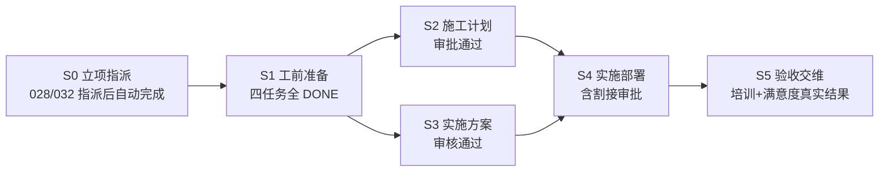

# 流程图模板发布与 S0～S5 全链验收记录（2026-09-24）

本目录是 `TPL-DELIVERY-FLOW-20260922`（ID `993009900014`）**发布后**的最终增量，承接上级 [配置记录](../README.md)、[接入增量](../integration/README.md)、[剩余内容交付](../remaining/README.md) 三个历史阶段。验收口径为需求方确认的两条路径：**发布 + 完整 S0～S5 真实项目验收**——直签路径（T6 对照，项目 `992203060028`）与渠道路径（T7，项目 `992203060032`）。本记录不晋级 F-PROJ-009 Feature Done，未创建提交、合并或推送。

- 环境：本阶段运行于修复分支端口 **后端 59291 / 前端 19291**（JDK 25 宿主机 + Compose `npdms-domain-test`，库 `npdms_domain_test`，租户 1）；历史记录中的 59191/19191 为前期端口。
- 模板最终态：**rev9（修订 ID `993009900034`）已发布，模板 ACTIVE**，发布回执 [rev9-publish-receipt.json](rev9-publish-receipt.json)（含 rev1～rev9 全部修订史）。
- 直签对照：项目 `992203060028`（PJT2026000021，rev7）**全部 17 任务 DONE**，初验/终验活动 COMPLETED，见 [s5-recheck-028.json](s5-recheck-028.json)；有效快照 [028-effective-snapshot.json](028-effective-snapshot.json)。
- 渠道验收：项目 `992203060032`（PJT2026000025，rev9）**S0～S4 应办任务全部 DONE，S5 为模板终态**（readiness `TERMINAL`、`gates=[]`），见 [s5-recheck-032.json](s5-recheck-032.json)；渠道分支仅直签任务（到货验收、初验、终验）保持 `PENDING_ASSIGN`。

## 验收口径（需求方裁决）

培训链、满意度调查等外发功能按**已有功能的正常用法**驱动到「有真实结果」，随后检测结果作为验收证据；**不跑任务级提交/收口链**（submission/complete），任务状态如实披露，不以「任务 DONE」为验收目标，以业务真实结果为准。验收中发现的缺陷按缺陷修复，不降校验、不绕状态机。

## 阶段与验收结果

- S1 工前四任务、S2/S3 审批链、S4 部署六任务（直签的到货验收在渠道路径按分支跳过）、S5 验收链在两个项目中按各自分支走通；S2/S3 并行窗口业务自动流转正常。
- S5 直签（028）：客户协调 → 初验 → 终验 → 培训 → 满意度全部执行，活动 COMPLETED；渠道（032）：客户协调 → 培训 → 满意度，初验/终验/到货任务按分支保持 `PENDING_ASSIGN`（仅直签任务的预期证据）。
- S5 终点不自动关闭项目：S6 闭环策略未配置，属已登记问题 [Q-TPL-FLOW-20260922-002](../../../decisions/open-questions.md#q-tpl-flow-20260922-002)，不随本验收处置。

## 割接上线：过渡审批（Q-004 处置披露）

rev7 起模板为 `DEPLOY_CUTOVER` 配置了门禁 BPM 引用，部署过渡流程定义 `PMS_DELIVERY_CUTOVER_APPROVAL`（描述明确标注：**割接完成外接接入前，审批通过即视为割接完成；后续替换为割接系统业务事实**）。028/032 均按「BPM 审批通过 → 事实 APPROVED → 任务完成 → S5 激活」走通。部署回执 [cutover-approval-deploy-receipt.json](cutover-approval-deploy-receipt.json)，rev7 规则绑定 [rev7-cutover-gate-receipt.json](rev7-cutover-gate-receipt.json)。该过渡方案不关闭 [Q-TPL-FLOW-20260922-004](../../../decisions/open-questions.md) 的正式处置（taskv2 生产入口注册 / 规则语义裁决仍待需求方）。

## S5 培训链（V348 表单修复披露）

培训记录 23（`PJT2026000025-PX-001`）CONFIRMED：三项评价齐全、手写签字图与附件已存、签字人李雷，见 [training-confirm-check.json](training-confirm-check.json)；任务保持 `IN_PROGRESS`（按口径不跑任务级收口）。

验收中发现培训客户确认表此前把「签字人姓名」设为必填，与手写签字板上含姓名的实际确认方式冲突，属半成品：本轮补完为 **V348 迁移 `acc001_confirmation_without_confirmer_name`**（Flyway 已应用，2026-09-24 01:00:50，随其后一次后端启动生效）——`customer-confirmation.json` 表单定义、`TrainingConfirmationFormPolicy` 必填集、`TrainingPublicConfirmReqVO` 校验与前端 `public-confirm.vue` 同步去除该必填项。**表单定义层不再包含姓名字段，接口层（VO）保留为可选输入**；本轮确认由验收驱动经外发确认 API 提交，`signConfirmerName` 按客户签字内容由 API 可选字段显式传入。确认时间 01:58:29 晚于 V348 应用时点，旧必填策略下该新表单修订无法通过策略兼容校验，时间线与修复生效互为佐证。历史确认记录只读不变。

## S5 满意度链与两处修复

满意度业务结果闭环：采集任务 2102823061109305345（PENDING_ARCHIVE）→ 问卷 ACTIVE（冻结 rev `2101717346254004226`，单题 Q1 非常满意=100/不满意=0，阈值 80）→ ASSISTED 代答辩卷（客户联系人「客户机房管理员-李雷」、assisted_by=1、02:11:01.660 提交，见 [satisfaction-response-receipt.json](satisfaction-response-receipt.json)）→ **score 100 / threshold 80 / passed / EFFECTIVE / ARCHIVED**，交付件 D_SATISFACTION ACCEPTED，见 [satisfaction-confirm-check.json](satisfaction-confirm-check.json)、[s5-satisfaction-receipt.json](s5-satisfaction-receipt.json)。

**修复一：交付件证据复核的文件身份（签名引用）。** 满意度/验收报告来源版本的文件复核原先只按单一身份（结果文档）校验，而签字图实际以**答卷**（`SATISFACTION_RESPONSE`/`SATISFACTION_SIGNATURE`）身份引用、归档副本落在归档引用集下，复核误判文件无效。`ProjectDeliverableOwnerSources.revalidate` 改为按身份候选序列（结果文档 → 答卷签字 → 归档副本）依次复验，命中即通过；不放宽哈希、版本与租户校验。覆盖测试 7 项通过（[fix-tests-receipt.json](fix-tests-receipt.json)）。

**修复二：满意度结果投影 vs 文档收集的 CURRENT 竞态（让位落库）。** 答卷 PDF 渲染触发的文件收集（PM-03）与满意度结果投影（ACC-04）都会写 D_SATISFACTION 的 CURRENT 来源版本，两者调度无固定先后：028 结果先到占 CURRENT（收集侧让位，成功）；032 收集先到，结果投影遇非本类型 CURRENT 抛 `SATISFACTION_SOURCE_TYPE_CONFLICT`，outbox 每分钟无限重试、ACC-04 来源行不落库。发现时序与两侧行为不对称证据见 [satisfaction-projection-conflict.json](satisfaction-projection-conflict.json)（修复前状态存证）。按需求方裁决「修复为让位落库」：`mayBecomeCurrent` 遇非本类型 CURRENT 改为按既有 SUPERSEDED 语义落库留痕并归档，不再抛异常，与收集侧让位对齐。部署后终态：事件 `sat-result:2102823061784588290:result-recorded` **DELIVERED**，ACC-04 来源行 SUPERSEDED+ARCHIVED，见 [satisfaction-defer-final-receipt.json](satisfaction-defer-final-receipt.json)；单测 4 项通过。「结构化结果与收集文档谁应拥有 CURRENT」的归属语义仍保持 OPEN，登记为 [Q-TPL-FLOW-20260922-005](../../../decisions/open-questions.md)（032 与 028 终态证据形态不一致，待规格裁决）。

## 规则引擎与计划快照修复

- **LiteFlow 链内嵌套重入**：事实解析器在链内嵌套评估另一条规则（交付件引用评估确认规则）时，LiteFlow 按归一化 EL 复用 Chain 对象，同线程重入破坏其节点引用栈并吞掉真实异常。`ProjectRuleEvaluationService` 改为**链外预解析全部提供者叶子、链内只回放结果**；CONSTANT/DECISION 保持原语义。测试 10 项通过。
- **计划激活快照冻结口径**：快照落库原先经全局 mapper 写出显式 null，回读后 JsonNode 字段成 NullNode，冻结校验的「未配置」判断（如连线条件）随之失真。`ProjectPlanActivationService` 改用 `TemplateExecutionSnapshot.freezeJson`（NON_NULL 冻结口径）落库；`ProjectPlanDraftService` 对快照读取失败补充 warn 日志。

## GRAPH_NODE_STALE 语义（只记录，不修）

`stage-advance-readiness` / 推进端点受运行图解析器的**单 ACTIVE 节点不变量**约束（`ProjectRuntimeGraphResolver`：非闭环检查路径要求恰好 1 个 ACTIVE 阶段节点）。两个观测面，均不阻塞业务：

1. **并行窗口**：S2/S3 双 ACTIVE 期间 readiness 查询报 `GRAPH_NODE_STALE`（030/032 驱动过程实测的过程观测，未单独归档回执）；任务完成与阶段自动激活不受影响，028/032 均完整穿越并行窗口。
2. **已完成图**：项目走完 S5 全部任务后 S5=DONE、零 ACTIVE，readiness 对 028 报 `GRAPH_NODE_STALE`（见 [s5-recheck-028.json](s5-recheck-028.json)）——端点无法表达「已完成无可推进」；仅配置了闭环策略的 closureCheck 路径豁免该形态（Q-002 未配置 S6 时必然如此）。业务终态以任务与验收活动数据为准。

处置：**只记录不修**。端点是读侧不变量表达问题，修复需先裁决 readiness 对并行窗口/已完成图的展示语义，不属本轮验收范围。

## 版本往返与项目弃用披露

- **rev8（修订 ID `993009900033`，2026-09-24 01:19 发布）为误修正**：验收排查中误把 S2/S3 并行改为串行并发布，项目 031 随其创建。确认与已确认业务口径（计划与方案并行）冲突后，**rev9（`993009900034`，01:24 发布）回退恢复并行语义**；rev8 成为历史修订，不回改、不撤回。两笔发布回执均存档（[rev8-publish-receipt.json](rev8-publish-receipt.json) / [rev9-publish-receipt.json](rev9-publish-receipt.json)）。
- 弃用项目（保留原状，仅作披露，均不删除）：
  - `992203060029`（channel-t7，rev7，停 S0）：创建后成员指派接口误用（405）产生的无成员重复项目，随即改用 030。
  - `992203060030`（channel-t7-fix，rev7，停 S2）：rev7 渠道路径驱动至 S2 的过程证据（含并行窗口 readiness 限制观测），T7 正式验收改用 rev9 项目 032。
  - `992203060031`（rev8a，rev8，停 S2）：rev8 误修正期间产物，rev9 发布后弃用。
- 既有保留：`992203060026`（S4 停滞，Q-004 证据）、`992203060021/025/027` 历史项目维持原状。

## 修复后的部署与验证

修复涉及 `pms-module-acceptance`、`pms-module-project`、`pms-module-engineering` 与前端培训确认页，随会话中的多次重建部署先后生效，其中两次时点有运行佐证：**01:00:50** V348 迁移随启动应用（01:58:29 培训确认在新策略下成功发起）；**约 02:39:00** 满意度投影让位与交付件文件身份修复部署（重启后事件 DELIVERED、来源行 ARCHIVED）。定向测试回执见 [fix-tests-receipt.json](fix-tests-receipt.json)（11+10 项通过）。032 终态复查（[s5-recheck-032.json](s5-recheck-032.json)）与满意度让位终态（[satisfaction-defer-final-receipt.json](satisfaction-defer-final-receipt.json)）均在**最后一次重启后**采集，证明修复在运行实例生效。

## 边界

- 任务级提交/收口链（submission/complete）未驱动：032 的 ACCEPT_TRAINING 保持 IN_PROGRESS、ACCEPT_SATISFACTION 保持 PENDING_ASSIGN，是口径内如实披露，不是缺口。
- S6 闭环未配置（Q-002）；割接完成事实的正式 Owner 接入待 Q-004 裁决；满意度证据归属语义待 Q-005 裁决。
- 本目录与各级记录均为生成证据，不晋级 Feature Done；未创建提交、合并或推送。
