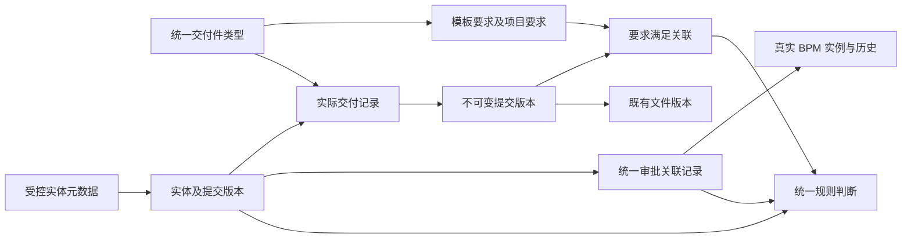

# 通用业务能力专项：现状核对与设计方案

日期：2026-09-22  
范围：当前工作树的代码、迁移定义与页面调用链；仅核对和方案交付。  
依据：本轮用户提出的统一交付件、实体元数据、业务操作、审批记录及规则判断要求。  
性质：待评议的专项方案，不是现有规格修订，不表示代码已实现或运行验收通过。

本轮不修改业务代码、数据库、现有 docs 规格、Feature/Task 状态，不执行工程实施链，不创建新审批流程或业务状态。以下标为“建议”的接口、模型和归属均为设计提案。引用的实现事实来自当前代码；没有连接数据库、操作浏览器或运行测试。

**建议采用一套配置驱动的业务能力底座：交付件记录、实体字段、审批事实各有唯一来源，业务页面和项目模板使用相同目录、服务及判断规则。保留已有领域命令、文件版本和审批历史。**

## 1. 现状核对

| 能力 | 已确认的实现 | 与本次目标的差距 | 处理建议 |
| --- | --- | --- | --- |
| 文件服务 | PLT 已有文件版本、引用、上传策略、受控访问、文件事实复核；项目材料页面使用 PmsFileUploader（S01、S07、S27） | 文件能力不等于交付件业务台账；工程归集仍有 UploadFile + fileUrl 路径（S28） | 复用文件底座，在其上形成统一交付登记和面板 |
| 自动生成文件 | 有 createGeneratedBusinessFile 接口 | 当前实现固定 ACC / SATISFACTION_RESULT，命令带采集任务、问卷、响应等专用字段（S02） | 抽出通用生成文件登记契约，满意度保留为兼容调用方；不把现状描述成已完全通用 |
| 类型目录 | 工程归集有 DAILY、RECEIPT、IMPLEMENTATION 等独立字典（S04、S05） | 验收检查单把 REQUIRED / OPTIONAL / CONDITIONAL 命名为 deliverableType；模板默认 DOCUMENT，缺少同一业务类型目录约束（S03、S10） | 分开“材料类型”“必交方式”“文件用途”，建立统一材料类型引用 |
| 要求与提交 | 已有模板定义、ACC 项目交付实例、来源版本和追加式提交证据；提交有幂等、计划快照和重新复核（S06、S07） | 提交强依赖 deliverable_id 与 plan_version_id，尚缺可独立于模板要求存在的通用实际交付记录 | 保留既有要求和证据；新增独立实际记录根及要求关联 |
| 自动归集 | 文件引用事件可按项目和来源码自动归集（S08、S09） | 来源接口仅返回 projectId、sourceCode，缺少阶段、任务、执行轮次和实体提交版本，不能据此精确区分同项目多个任务 | 归集直接使用经过校验的完整业务上下文和明确要求绑定 |
| 交付判定配置 | 后端支持 confirmationRule；当前编辑器保存时固定写 constantRule(true)（S07、S10） | 当前页面表达“有效材料及数量达标”，不能配置本次要求的独立提交、人工确认或审批条件 | 新配置版本提供完整条件；旧模板不被静默改写 |
| 实体元数据 | EntityRef、EntityDataRef、EntityFieldProvider、字段映射、扩展字段版本和表单绑定已存在（S11—S14） | 固定字段描述只有编码、类型、必填；字段映射默认读取类声明属性；尚非统一的受控展示/判断目录。现有扩展值仍依附业务提供方 | 增强受控元数据目录、关联和版本语义，复用扩展字段与表单机制 |
| 完成判断 | 项目字段目录、LiteFlow 编译、已知空值/未知事实语义已存在（S15、S17、S18） | BUSINESS_FACT 目录主要由逐实体提供方声明专用完成事实；实体字段目录尚未直接成为统一业务规则来源（S16） | 保留引擎；补三类通用事实入口，停止新增普通布尔结果适配器 |
| 业务操作 | 有操作目录、冻结版本分发、权限与执行轮次复核、幂等执行（S19、S20） | 当前主要围绕项目节点执行；“配置一个普通实体即可使用整套通用操作”还未形成 | 扩展共享能力注册和独立业务入口；领域命令继续执行实际业务行为 |
| 节点审批 | 任务/阶段审批从真实 BPM 实例读取结果，校验流程版本、轮次、发起人及尝试编号（S21、S22） | Scope 关联节点执行，没有普通业务实体及其提交版本的统一关联表 | 复用 BPM；建立统一关联记录和查询接口 |
| 其他审批 | 实施方案存在本地批准命令，阶段计划已接 BPM；CUT 还有分级审批表及专用内核（S23—S26） | 现状不是所有审批均由同一个 BPM 关联模型管理，不能直接迁移表中“通过”值 | 分来源映射；保留历史，逐条完成真实流程接入 |
| 界面 | 已有版本化业务视图注册、通用宿主及专用页面（S29、S30） | 上传、材料列表、审批展示、字段和操作仍存在模块各自组织的路径 | 形成共享页面区块，复杂专业内容保留专用组件 |

边界说明：CUT 本轮核对到模型和审批内核，未核验其运行装配或完整功能可用性。旧 proj_project_deliverable 类的存在，也不能证明它仍是当前交付事实的写入来源。本方案以已核对的 ACC 提交链为增量起点。

## 2. 统一模型与关联

建议用以下关系表达业务；图中是逻辑模型，不是本轮新增的数据库表。

### 2.1 共享身份与上下文

复用 EntityRef 的 tenantId、ownerModule、entityType、entityId；精确内容使用 EntityDataRef / RevisionRef。所有能力使用同一业务上下文：

- projectId：项目身份。
- stageInstanceId、taskInstanceId：实际阶段和任务实例，不能用显示名称代替。
- planVersionId、nodeExecutionId：需要按模板执行时绑定的计划和本轮执行。
- entityRef、entityRevisionRef：业务对象及此次使用的不可变内容。
- requirementInstanceId：具体交付要求；可关联多个明确要求，但不靠类型相同自动满足全部要求。

租户与操作者来自服务端会话。服务端通过项目公开接口核对“任务属于阶段、阶段属于项目”，通过实体 Owner 接口核对对象及版本归属；页面传来的 ID 只是请求参数。

**建议允许明确的 PROJECT / STAGE / TASK 归属。** 在任务中产生的记录必须写全项目、阶段、任务；阶段级、项目级业务不伪造任务。缺少 taskId 绝不意味着记录可以供项目内所有任务判定。任务选择和执行关联也不反过来定义业务实体的身份。

如果一个实体服务多个任务，用显式关联记录表达多个使用上下文，不不断覆盖实体上的 taskId，也不复制实体或文件。

### 2.2 必须分开的四种版本

| 版本 | 含义 |
| --- | --- |
| rowVersion | 并发更新校验，不自动等于业务版本 |
| entityRevision / submissionRevision | 业务内容及附件集合的不可变版本，审批精确引用它 |
| definitionRevision | 类型策略、元数据、操作、规则和流程定义的配置版本 |
| nodeExecutionId + planVersionId | 任务/阶段本轮执行依据，返工后的新一轮不能借用旧轮次结果 |

状态查询可以有缓存和 current 指针；用于完成判定的证据必须指向精确版本，不能只读一个最新状态字段。

## 3. 通用交付件

### 3.1 类型、要求、实际记录分别管理

| 逻辑对象 | 管理内容 | 主要约束 |
| --- | --- | --- |
| DeliverableType | 稳定编码、名称、分类、启停、文件约束与策略版本 | 同租户编码唯一且不复用；停用限制新使用，历史仍可解释 |
| DeliveryRequirement | 模板/项目要求、类型引用、必交方式、适用条件、数量、提交和确认要求 | “必交/选交/条件”独立于类型；项目实例冻结要求版本 |
| DeliverableRecord | 实际材料身份、类型、来源实体、项目及产生上下文 | 没有模板要求也能登记；多个页面查询同一 recordId |
| DeliverableSubmission | 某次提交的文件版本清单、实体版本、提交人和时间 | 提交后只追加新版本；不能覆盖旧文件集合 |
| RequirementFulfillment | 要求与实际提交版本的明确关联、计划/轮次、判断证据 | 类型匹配只是必要条件；还要匹配范围和具体要求 |
| DeliveryConfirmation | 对精确提交版本的确认记录或审批记录引用 | 人工确认与 BPM 审批不同，不能共用一个可手改“通过”字段 |

文件仍保存在既有 FileArtifact / FileVersion 中。文件可被多个授权业务引用；交付业务不再另存一份文件正文，也不以裸 URL 代替文件身份。直接从项目或任务上传时，来源主体就是实际项目或执行对象，不伪造一个业务实体。

同一个实际提交供多个要求使用时，只增加明确关联。是否允许复用由要求配置确定；不能因为项目和类型一致就扇出为全部要求已满足。

**数量建议明确计数单位。** 新要求默认可选“交付记录数”或“文件数”，一份交付记录多个版本不能重复凑数，同一要求重复关联同一材料也不重复计数。具体默认值在类型/要求配置中明确。旧模板按现有文件数量口径保持原义，不自动换成记录数量。

### 3.2 一条登记链，两类文件来源

人工上传：选择类型和业务上下文 → 既有文件上传/安全校验 → 统一登记实际材料 → 提交固定文件版本集合 → 按要求配置确认或发起审批。

业务生成：领域命令生成文件内容 → 复用文件安全及版本服务 → 调用相同材料登记入口 → 按相同提交和确认规则继续。

文件上传完成后即可在统一台账中看到“已登记、未提交”的材料；不需要等某个任务配置存在才归集。上传失败或完成登记失败保留可恢复的操作回执，利用既有上传补偿处理存储副作用，不伪造成功记录。

上传成功、提交完成、人工确认完成、真实审批通过分别记录。要求可以只检查有效上传，也可以要求正式提交、指定确认或审批；类型本身不能暗含这些业务规则。

复用 FileArtifactApi 的版本和访问逻辑。针对当前生成文件接口中的满意度专用参数，新增通用命令载体，旧调用封装转发；不破坏满意度原始证据和调用契约。

### 3.3 归属与权限

登记服务校验类型启用、文件策略、来源实体可操作、文件归属及上下文。类型策略和实体文件权限同时生效，页面配置只能进一步收窄约束。

业务页面、任务交付面板、项目交付列表通过同一查询接口展示记录和历史。能看见台账不自动取得文件下载权，文件内容仍走原受控访问检查。

文件作废、来源撤销或版本替换只改变当前有效性并触发重评；原提交、批准和任务完成历史保留。已完成项目按既有证据失效/返工机制处理，不自动清空完成记录。

## 4. 实体元数据与配置接入

### 4.1 一个目录同时服务页面与规则

建议增加受控 EntityDescriptor，复用现有字段类型、扩展字段版本和表单绑定，补充：

- 实体稳定编码、所属模块、显示名、可用操作、版本能力。
- 字段编码、名称、数据类型、字典/枚举来源、单位、可读/可写/可用于判断范围。
- 字段来源为固定字段或已有扩展字段；配置只开放 Owner 已提供的字段。
- 关系编码、目标实体类型、基数、上下文约束、受控查询能力。
- 目录版本及字段废弃信息，已发布配置引用固定版本。

字段映射反射可用作发现候选字段的内部工具，不能把所有 DO 字段直接开放给配置人员。Secret、内部授权标记等不进入目录；普通新增列也不自动成为可读、可写或可用于判断的字段。

前端表单、规则选择器、后端校验和运行读取使用同一目录。字典名称由配置解析，比较使用稳定值，不在前后端分别维护“完成状态字段”和“通过值”清单。

### 4.2 不再让普通实体承担一组适配器

配置接入分两类，但上传、审批、规则和界面能力完全共享：

| 接入模式 | 如何取得数据 | 新增同类实体时的成本 |
| --- | --- | --- |
| 普通配置记录 | 建议提供一个通用记录执行器及修订存储，保存按元数据定义的普通业务记录；复用现有扩展值和表单机制 | 增加元数据、页面、操作和权限配置即可；不写实体专用结果/上传/审批 Provider |
| 既有领域实体 | 复用 Owner 已有字段/版本接口和业务命令，建立受控数据集/命令注册；已有 EntityFieldProvider 作为兼容接入口 | 已开放字段、关系与命令用配置组合；未开放数据需要 Owner 一次接入，不为每个“条件”新增类 |

通用记录执行器只管理自身存储，不接管已有方案、计划、割接等领域表。现有 EntityProviderRegistry 需要一次扩展：普通配置实体按元数据路由到同一个执行器，已接入领域实体继续走原提供方；不为每个配置类型生成一个新的 Bean 或 Java 类。对于任意新建的专有业务表，不能承诺只填一个表名就安全获得业务能力；数据读取、授权和真实命令必须先有受控接入口。这与“普通规则无需专用结果适配器”是两个不同层次。

为了兑现“新增普通业务实体后仅配置即可闭环”的验收标准，**普通配置记录能力必须纳入实施范围**。当前 EntityExtensionApi 只提供附属字段，并不已经具备独立业务实体创建能力；不能用已有扩展值表存在来宣称该目标已达成。

建议普通记录的通用存储由 PLT 提供，业务配置仍声明其管理模块、权限和范围。现有领域表的写入职责保持在原模块。这是本方案的新增能力归属建议，尚未变更任何现有 Owner。

### 4.3 受控读取

关系查询按注册的 Query/读取能力执行；通用层不传任意 SQL、表名、列名或脚本，不直接跨模块联表。结果返回实体/版本引用、字段值、集合是否完整及不可用原因。多记录判断按 Owner 批量读取或使用其受控聚合查询，不能只取列表首页就计算 ALL/COUNT，也不能由浏览器拼装完成事实。

未知字段、无权读取、不存在的关联、版本不匹配分别返回可解释的不可用结果。真实已知 null 仍可以参与 isNull 判断，未知不能伪装成 null。

## 5. 统一审批关联与真实流程

### 5.1 统一记录的内容

建议 ApprovalRecord 至少包含：租户、记录 ID、业务上下文、实体身份、不可变提交版本、审批配置版本、实际流程定义 key/id/version、流程实例 ID、业务关联键、发起人、发起时间、尝试序号、前次记录、结果和结果来源版本。

ApprovalRecord 是业务关联及结果查询入口；任务分配、审批动作、意见和流程历史由 BPM 管理。结果字段仅由经过真实流程核验的内部处理更新，不提供修改审批结论的通用 CRUD。

节点审批以真实阶段/任务执行对象作为审批对象，适配已有 ProjectNodeApprovalApi；普通实体直接作为对象，不再创建伪任务承载审批。

### 5.2 发起、撤回、重提

1. 服务端校验实体权限、上下文、操作条件及版本。
2. 固定审批提交版本，包括实际审阅字段和附件的精确版本；已有业务修订直接复用。
3. 复用现有精确流程定义启动能力，由 BPM 检查发起权限、表单与审批人。
4. 同一幂等键和请求返回原记录、原流程；同键不同内容拒绝。并发不同键也不能重复启动同一实体版本、逻辑审批配置及适用上下文下的有效审批；配置发布新版本不能绕过这一约束。
5. 撤回通过 BPM 原有命令执行；是否可撤回沿用实际流程规则。
6. 驳回/撤回后重提生成新 ApprovalRecord 和流程尝试，保留原记录与意见。

当前是模块化单体，应优先复用同事务和现有幂等设施；需要异步交接时使用已有 outbox 及可恢复回执。启动部分失败必须可恢复，不能出现“业务记录已通过、流程未创建”的状态。

没有不可变版本能力的普通实体，由通用记录执行器在提交时创建内容快照并绑定修订；已有领域实体采用其 Owner 提供的修订或受控快照能力。单独保存乐观锁数字不能证明审阅内容未变化。

内容变更后新版本不继承旧版本批准。审批中的旧版本仍可在历史中查看；是否自动撤回取决于既有流程规则，不擅自新增自动撤回行为。

### 5.3 规则如何读审批

查询条件必须精确包含实体、提交版本、审批配置/流程定义以及适用上下文。默认判断本版本该审批配置的当前有效尝试，不能“历史任一次通过就永远通过”。

BPM 事件是更新查询记录及唤醒规则重评的信号。消费时核验租户、流程实例、定义、businessKey 与实体版本；重复事件幂等处理，乱序事件不能把终态退回进行中。查询投影未对齐时同步核验真实流程或返回 UNKNOWN，不能放行。

“流程批准”与“领域命令已生效”分别判断。例如计划批准后尚未成功应用，审批事实可以为真，计划生效字段仍未满足；不通过改审批记录掩盖命令失败。

### 5.4 现有非统一审批的迁移边界

- 节点和阶段计划：保留现有真实 BPM 历史，映射统一业务关联及版本。
- 实施方案本地批准：保留原批准人、意见及基线，作为历史业务决策。没有流程实例的记录不能伪造为 BPM 批准；新统一流程需采用已明确的审批路线和审批人规则。
- CUT 分级审批：保留源版本、等级、路线、意见、暂停和失效语义。迁移到 BPM 前完成逐项流程语义映射，不能压成一个“已通过”字段。
- 无法证明实体版本的旧审批，只作历史展示/待映射证据，不充当新版本的批准。已冻结旧流程按原契约读取，不重写其历史结论。

因此，“所有旧审批立即变为统一 BPM 流程”不能作为仅增加一张记录表就已完成的工作。

## 6. 通用操作与共享界面

沿用现有操作注册、受控分发和执行回执，建议每个操作定义包含：稳定编码与版本、输入 Schema、权限引用、前置规则、执行器引用、后置规则、执行记录与界面呈现。

| 通用操作 | 执行方式 |
| --- | --- |
| 保存普通记录 | 通用记录命令，按元数据校验、权限和版本控制写入 |
| 保存已有领域对象 | 调用原 Owner 保存命令，保留业务校验 |
| 登记/上传/提交材料 | 调用统一交付服务及既有文件服务 |
| 发起/撤回审批 | 调用统一审批入口，由 BPM 执行 |
| 查看材料/审批/历史 | 调用相同记录查询接口 |
| 人员指派、割接执行等 | 调用已注册的真实领域命令 |

执行器注册是服务端受控能力；配置不能指定任意 Bean 方法、URL、SQL 或反射写业务表。按钮可见只是展示条件，服务端重新授权并验证状态。操作返回成功只说明命令结果；是否完成任务仍由规则和正式生命周期服务决定。

建议在已有 BusinessViewHost 与表单基础上提供：通用实体表单/详情、交付件面板、审批面板、操作栏、历史面板。页面配置布局、字段和操作，公共区块使用同一上下文。

这些区块可从业务菜单独立运行，也可嵌入项目/任务。WorkBinding 只负责带入上下文和编排，不成为普通业务使用上传与审批的前置条件。复杂专业编辑器保留原有交互，公共区块不再重复实现。

## 7. 统一规则判断

复用现有 LiteFlow 编译、RuleFact、诊断和项目运行时。新增的是三类业务事实读取协议，不新建第二套规则引擎：

| 事实类 | 规则配置 | 取证来源 |
| --- | --- | --- |
| ENTITY_FIELD | 实体/关系、字段、比较方式、值、版本和集合量词 | 受控实体元数据与 Owner/通用记录读取接口 |
| DELIVERABLE | 类型、具体要求、上下文、数量口径、上传/提交/确认条件 | 统一记录、提交版本、要求关联及文件有效性 |
| APPROVAL | 实体版本、审批配置/流程、当前尝试及结果 | 统一审批记录与真实 BPM 核验 |

现有任务状态、阶段状态、时间、里程碑、子项目等待等结构性规则继续保留。“三类事实”指本次归纳的业务事实，不能据此删除其他已有规则能力。

实体关系使用登记的 relationCode。多条记录明确选择 ANY、ALL 或 COUNT，禁止隐含“第一条”“任意最新一条”或“同项目全部记录”。

建议延续当前严格取证习惯：

- 事实和集合完整性均可靠时才给出明确比较结果；本应参与判断但无法读取的记录不能被过滤掉后冒充完整集合。
- ALL 默认要求非空，避免空集合自动通过；空集合语义在规则中明确固定。
- COUNT 明确去重单位及数量比较，不能把多个版本当多份结果。
- 缺失、未知或版本失配不当作通过；NOT(UNKNOWN) 仍为 UNKNOWN。
- 前置权限使用真实操作者；后台重评使用受控执行身份，仅能读取规则所需事实，不把隐藏字段值泄露到前端诊断。

发布配置时校验字段/字典/关系、操作和流程版本可用性，以及规则依赖环。例如“任务完成等待交付确认、交付确认又等待该任务完成”必须报出环路。

运行时先读取同一业务版本的事实，完成命令在既有事务/锁顺序下重新核验。事件只触发重评；完成证据保存规则版本、实体版本、交付提交 ID、审批记录/流程 ID 与判断结果。实体变更、交付件失效、审批变化均纳入既有事件与重评链。

以用户给出的施工记录场景为例，配置者选“关联施工记录 → 已开放完成字段 → 既定完成值”，再组合“当前任务某类型交付记录数量达标”和“该实体本次提交审批通过”。此过程不生成“施工完成/方案通过/计划通过”等专用 Java 结果提供方。

## 8. 接口和模块落点建议

以下为提议的能力契约名称，尚未创建 API 或 Schema。新增 PMS HTTP 接口继续使用 /api/v1/pms/...，沿用仓库的返回和错误约定。

| 契约 | 输入和输出重点 | 建议落点与复用 |
| --- | --- | --- |
| EntityCatalogApi | 实体类型及目录版本 → 字段、字典、关系、操作目录 | PLT 元数据；扩展既有 entity API |
| EntityFactsApi | EntityRef/修订/关系查询、字段集合、受控身份 → 值、证据版本、完整性 | PLT 统一协议，数据由原 Owner 或普通记录执行器提供 |
| DeliverableCatalogApi | 类型列表、启停和策略版本 | 建议沿用 ACC 交付事实管理职责，不因项目页展示而迁到 PROJ |
| DeliverableRegistrationApi | 上下文、类型、来源实体、文件引用、幂等键 → recordId | ACC 统一业务登记，PLT 管理文件 |
| DeliverableSubmissionApi | recordId、期望版本、文件集合、要求关联 → 不可变提交回执 | ACC；复用现有提交、证据复核和 outbox |
| ApprovalAssociationApi | 实体提交版本、上下文、审批配置、表单/审批人 → 记录及流程实例 | 协议可置于已有 PLT API，PMS 扩展实现在 BPM，避免业务模块依赖其实现 |
| BusinessOperationApi | 操作版本、上下文、输入、并发版本、幂等键 → 受控回执 | 复用现有操作注册/执行；领域命令仍由原模块实现 |
| RuleEvaluationApi | 已冻结规则、上下文、受控身份 → TRUE/FALSE/UNKNOWN 及证据 | 复用 PROJ 现有引擎和执行链，不复制另一个解释器 |

每个跨模块调用通过公开 API，不依赖目标模块 Service/Mapper 或业务表。表名和部署位置不是新的业务 Owner；业务所有权与原始事实来源在注册中明确。

建议的最小持久化增量：

- ACC：类型目录及策略版本、独立交付记录/提交版本、要求关联、精确提交的确认记录。
- PLT：实体元数据目录版本；普通配置记录及不可变修订。复用扩展定义、值和表单绑定，避免为每种字段建一套存储。
- BPM：统一业务审批关联记录及可追溯的结果同步信息，流程意见仍存原 BPM 历史。
- PROJ：继续保存模板/项目要求和冻结规则，引用统一类型和实际记录；现有 ACC 要求实例及历史来源链不搬迁后再重建。
- 兼容映射：保存旧来源类型、来源 ID、来源版本与新记录 ID 的对应关系，唯一键防止重复导入。

当前 acc_project_deliverable_submission 强制关联要求和计划，不能简单改个类名就承载无模板业务记录。建议新增独立实际记录模型，旧提交作为原始历史保留并建立映射；迁移完成后新写入集中到新服务，不长期维护两套结果。

## 9. 存量迁移与实施顺序

| 步骤 | 应交付的具体增量 | 完成判据 |
| --- | --- | --- |
| 1. 类型和关联模型 | 统一目录、旧类型映射、完整上下文、元数据与版本契约；列出本地审批和专用审批的迁移边界 | 模板与业务入口能选择同一类型；阶段/任务与实体版本身份可校验 |
| 2. 基础记录和通用闭环 | 普通记录执行器；独立交付登记/提交/确认；BPM 统一关联、发起、撤回、重提；通用面板 | 不依赖项目模板，也能通过配置保存普通实体、上传和审批 |
| 3. 实体字段与统一规则 | 三类通用事实、ANY/ALL/COUNT、未知语义、依赖环检查及事件重评 | 同一目录配置和执行；不新增实体专用布尔结果提供方 |
| 4. 页面与模板共同接入 | 项目、任务、业务页面共享台账；模板引用统一类型和审批配置 | 三入口展示同一记录/版本；模板完成判断命中同一真实事实 |
| 5. 存量映射与重复路径退出 | 分批映射旧文件、提交、批准；旧调用转发；冻结历史保持原解释 | 新写入只有一个归集和判断来源；旧证据可回溯、可解释 |

迁移前只读盘点实际存量：三套类型及使用量、URL 文件是否能对应受控版本、来源业务到阶段/任务的关系、审批实例和实体版本是否齐全。本轮未查询数据库，不能给出已核实的存量数量或自动迁移成功率。

迁移规则：

1. REQUIRED / OPTIONAL / CONDITIONAL 只映射要求属性，不映射材料类型；DOCUMENT 也不能凭名称自动猜成实施方案或培训记录。
2. 类型、阶段、任务、文件版本不能唯一确定的，保存原始证据并列为待映射；不填虚构的默认值后参加新规则。
3. 已受控的文件版本引用复用；仅有 URL 的历史材料需核实文件身份和权限再登记，不能仅有 URL 就视为有效提交。
4. 新记录追加关联，旧快照、审批意见、批准版本、来源 ID 和完成历史不更新覆盖。
5. 新配置用新规则版本；已发布模板和运行项目按冻结版本解释。计划改版通过现有正式入口，不能后台批量替换规则含义。
6. 双路径期间做只读对照和对账，不把两边写出的状态都当作事实；完成一条业务迁移后，旧入口调用统一服务。
7. 已写入新记录后，回退不能简单恢复旧写入路径导致分叉。保留兼容读取、停止有问题的新入口，按来源映射恢复或前向修复，不删除新增历史。

迁移期间允许旧专用提供方读取被冻结的历史契约；不再给它们增加新条件。退役以消费者切换和历史查询仍可解释为依据，不以类文件数量减少为目标。

## 10. 验收场景

本轮仅制定验收，不宣称下表已执行。

| 场景 | 必须看到的结果 |
| --- | --- |
| 新增一个普通实体类型及一种材料类型 | 只增加元数据/配置即可保存、上传、展示、审批及配置规则，无专用结果/上传/审批适配器 |
| 独立业务入口 | 没有 WorkBinding 和模板要求时仍可登记、提交、发起审批 |
| 业务、任务、项目三个入口 | 同一 recordId、提交版本、文件历史和审批关联；任一入口更新后其他入口读取一致 |
| 同项目两个任务使用相同类型 | 一个任务提交不会默认满足另一个任务 |
| 一份材料明确供多个要求使用 | 共用记录，通过明确关联使用，不复制文件、不重复计算同一要求数量 |
| 类型停用与约束收窄 | 新使用按新配置受限，旧提交按冻结策略可追溯；安全失效仍实时生效 |
| 上传、提交、确认、审批四个事实 | 规则按配置分别判断；上传响应成功不等于已提交或审批通过 |
| 人工上传与系统生成 | 进入同一台账、文件版本和归属校验路径 |
| 审批后修改字段/附件 | 新提交版本不获旧批准；原批准内容和意见可回看 |
| 驳回、撤回、重提 | 产生新尝试并保留历史；旧批准/旧尝试不能错误满足当前查询 |
| 并发发起与响应丢失重试 | 同一意图唯一记录和流程，不重复提交；异载荷复用幂等键被拒绝 |
| 伪造或乱序审批回调 | 不产生假批准、不把终态倒退；实际 BPM 结果可核验 |
| 审批通过但领域应用失败 | 两类事实明确区分，不错误推进计划或任务 |
| 跨租户、跨项目、无字段/文件权限 | 服务端拒绝或返回不可用，不因通用配置放宽权限或泄露值 |
| 空集合、缺失字段、不可读记录、NOT UNKNOWN | 不误判通过，诊断可说明欠缺证据且不泄露隐藏数据 |
| ANY / ALL / COUNT | 关系范围、非空要求、计数单位与版本去重符合明确配置 |
| 循环依赖与元数据不兼容 | 配置发布时指出具体冲突，不运行成永远无法完成的闭环 |
| 文件/来源/审批失效 | 触发重评并保留旧完成历史，按正式返工处理 |
| 旧文件和审批映射 | 来源不丢、不能验证的旧数据不伪装为新有效证据 |
| 真实浏览器完整操作 | 从新配置进入保存、上传、重开、审批、驳回重提、历史回看和冲突操作，后端读取证据一致 |

重点验证模块为 PLT 文件/实体能力、ACC 交付服务、BPM 关联处理、PROJ 规则与运行时，以及实际迁移的直接业务消费者。实施时做针对性服务/事务/迁移检查及真实浏览器验收，不以构建或界面可打开替代上述业务结果。

## 11. 本方案的建议与待补齐信息

建议评议的实现选择已经具体化：沿用 ACC 管理交付事实，PLT 提供元数据及普通记录基础，BPM 维护真实流程及关联；采用精确业务版本、明确的项目/阶段/任务范围，分批切换存量。

进入实现前，需要从实际配置和存量核实的内容只有会改变业务结果的部分：

- 本地方案审批及 CUT 分级审批对应的流程定义、路线和审批人规则；本方案不新增角色或审批节点。
- 旧类型和 DOCUMENT 等宽泛分类的明确映射，旧文件和旧业务记录的真实阶段/任务归属。
- 各类已有实体实际可开放字段、关系、版本和写入命令；没有稳定提交版本的接入方式。
- 实际要求的数量单位、是否允许同一材料满足多个要求，以及确认所指人工确认还是指定审批。

这些事项保留在本专项方案中供后续核实；本轮不登记或改写 docs 的问题、规格或批准状态。不影响现状核对和通用能力设计的交付。

## 12. 当前代码证据索引

以下链接均指向本轮读取的工作树文件；它们是实现证据，不是运行验收结论。

- S01：[文件版本、引用和生成接口](M:/AICoding/CodexData/worktrees/a4f5/NPDMS/pms-module-platform/pms-module-platform-api/src/main/java/cn/iocoder/yudao/module/pms/platform/api/file/FileArtifactApi.java:34)。
- S02：[生成文件当前限定满意度结果](M:/AICoding/CodexData/worktrees/a4f5/NPDMS/pms-module-platform/src/main/java/cn/iocoder/yudao/module/pms/platform/service/file/GeneratedBusinessFileService.java:44)。
- S03：[检查单将必交属性命名为类型](M:/AICoding/CodexData/worktrees/a4f5/NPDMS/pms-module-acceptance/src/main/java/cn/iocoder/yudao/module/pms/acceptance/dal/dataobject/deliverablechecklist/DeliverableChecklistDO.java:15)。
- S04：[工程归集的类型、来源与文件地址](M:/AICoding/CodexData/worktrees/a4f5/NPDMS/pms-module-engineering/src/main/java/cn/iocoder/yudao/module/pms/engineering/dal/dataobject/deliverable/DeliverableDO.java:20)。
- S05：[工程归集独立字典](M:/AICoding/CodexData/worktrees/a4f5/NPDMS/sql/migrations/V309__eng_deliverable_dict_alignment.sql:27)。
- S06：[提交证据必须依附既有交付要求实例](M:/AICoding/CodexData/worktrees/a4f5/NPDMS/sql/migrations/V332__project_deliverable_automatic_submission.sql:2)。
- S07：[交付提交、幂等、复核与归集](M:/AICoding/CodexData/worktrees/a4f5/NPDMS/pms-module-acceptance/src/main/java/cn/iocoder/yudao/module/pms/acceptance/service/acceptance/ProjectDeliverableSubmissionService.java:91)。
- S08：[自动归集来源仅返回项目和来源码](M:/AICoding/CodexData/worktrees/a4f5/NPDMS/pms-module-platform/pms-module-platform-api/src/main/java/cn/iocoder/yudao/module/pms/platform/api/file/FileDocumentSourceProvider.java:8)。
- S09：[文件引用事件按项目和来源归集](M:/AICoding/CodexData/worktrees/a4f5/NPDMS/pms-module-acceptance/src/main/java/cn/iocoder/yudao/module/pms/acceptance/service/acceptance/ProjectDocumentCollectionService.java:20)。
- S10：[模板默认类型及保存时固定确认规则](M:/AICoding/CodexData/worktrees/a4f5/NPDMS/yudao-ui/yudao-ui-admin-vue3/src/views/pms/project/project-templates/DeliverableRuleDialog.vue:38)。
- S11：[现有固定字段描述](M:/AICoding/CodexData/worktrees/a4f5/NPDMS/pms-module-platform/pms-module-platform-api/src/main/java/cn/iocoder/yudao/module/pms/platform/api/entity/EntityField.java:4)。
- S12：[字段映射来自业务类声明属性](M:/AICoding/CodexData/worktrees/a4f5/NPDMS/pms-module-platform/pms-module-platform-api/src/main/java/cn/iocoder/yudao/module/pms/platform/api/entity/EntityFieldMapping.java:19)。
- S13：[当前每种实体寻找唯一字段提供方](M:/AICoding/CodexData/worktrees/a4f5/NPDMS/pms-module-platform/src/main/java/cn/iocoder/yudao/module/pms/platform/service/entity/EntityProviderRegistry.java:18)。
- S14：[扩展字段定义、版本与值](M:/AICoding/CodexData/worktrees/a4f5/NPDMS/pms-module-platform/pms-module-platform-api/src/main/java/cn/iocoder/yudao/module/pms/platform/api/entity/EntityExtensionApi.java:7)。
- S15：[项目规则字段目录](M:/AICoding/CodexData/worktrees/a4f5/NPDMS/pms-module-project/src/main/java/cn/iocoder/yudao/module/pms/project/service/rule/ProjectRuleFields.java:16)。
- S16：[专用完成事实目录](M:/AICoding/CodexData/worktrees/a4f5/NPDMS/pms-module-project/src/main/java/cn/iocoder/yudao/module/pms/project/service/taskbusiness/TaskBusinessProviderRegistry.java:22)。
- S17：[现有规则编译复用 LiteFlow](M:/AICoding/CodexData/worktrees/a4f5/NPDMS/pms-module-project/src/main/java/cn/iocoder/yudao/module/pms/project/service/rule/ProjectRuleCompiler.java:18)。
- S18：[已知空值与未知事实的区分](M:/AICoding/CodexData/worktrees/a4f5/NPDMS/pms-module-project/src/main/java/cn/iocoder/yudao/module/pms/project/domain/rule/RuleFact.java:3)。
- S19：[冻结操作版本分发](M:/AICoding/CodexData/worktrees/a4f5/NPDMS/pms-module-project/src/main/java/cn/iocoder/yudao/module/pms/project/service/operation/ProjectOperationDispatcher.java:22)。
- S20：[受控执行和幂等](M:/AICoding/CodexData/worktrees/a4f5/NPDMS/pms-module-project/src/main/java/cn/iocoder/yudao/module/pms/project/service/operation/ProjectControlledOperationExecutor.java:43)。
- S21：[审批关联执行轮次的现有范围](M:/AICoding/CodexData/worktrees/a4f5/NPDMS/pms-module-project/pms-module-project-api/src/main/java/cn/iocoder/yudao/module/pms/project/api/approval/ProjectNodeApprovalApi.java:45)。
- S22：[真实流程发起、重试和审批事实](M:/AICoding/CodexData/worktrees/a4f5/NPDMS/yudao-module-bpm/src/main/java/cn/iocoder/yudao/module/bpm/service/task/PmsNodeApprovalProcessOwner.java:84)。
- S23：[实施方案本地审批及自动归集](M:/AICoding/CodexData/worktrees/a4f5/NPDMS/pms-module-engineering/src/main/java/cn/iocoder/yudao/module/pms/engineering/service/solution/SolutionServiceImpl.java:119)。
- S24：[阶段施工计划发起 BPM](M:/AICoding/CodexData/worktrees/a4f5/NPDMS/pms-module-engineering/src/main/java/cn/iocoder/yudao/module/pms/engineering/service/stageplan/StagePlanBatchServiceImpl.java:274)。
- S25：[割接分级审批专用模型](M:/AICoding/CodexData/worktrees/a4f5/NPDMS/sql/migrations/V184__fcut005_p5_graded_approval.sql:1)。
- S26：[割接专用审批内核，未据此推断运行可用性](M:/AICoding/CodexData/worktrees/a4f5/NPDMS/pms-module-cutover/src/main/java/cn/iocoder/yudao/module/pms/cutover/service/approval/CutoverApprovalApplicationService.java:56)。
- S27：[项目材料使用 PMS 文件组件](M:/AICoding/CodexData/worktrees/a4f5/NPDMS/yudao-ui/yudao-ui-admin-vue3/src/views/pms/project/project-master-detail/components/ProjectDeliverableDialog.vue:21)。
- S28：[工程归集仍使用 URL 上传组件](M:/AICoding/CodexData/worktrees/a4f5/NPDMS/yudao-ui/yudao-ui-admin-vue3/src/views/pms/engineering/deliverable/index.vue:147)。
- S29：[已有版本化业务视图注册](M:/AICoding/CodexData/worktrees/a4f5/NPDMS/pms-module-platform/src/main/java/cn/iocoder/yudao/module/pms/platform/domain/businessview/BusinessViewDescriptor.java:12)。
- S30：[业务视图前端注册与既有专用组件](M:/AICoding/CodexData/worktrees/a4f5/NPDMS/yudao-ui/yudao-ui-admin-vue3/src/components/BusinessView/registry.ts:1)。

本轮产物仅为此独立方案。未修改代码或执行迁移、未运行测试/浏览器、未提交 Git，也未将现状核对结果写成任何 Feature 完成状态。
