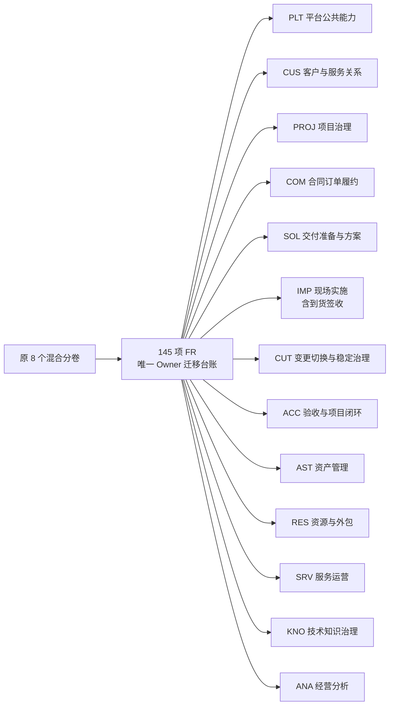

# 13 领域需求规格拆分验证报告

## 1. 验证结论

现有正式需求已按《项目实施交付管理平台规格体系调整原则（13领域版）》拆分为 13 份唯一 Owner 领域需求分卷。各分卷沿用原文档的五段式结构，不使用通用 SRS 十二章模板。145 项正式 FR 全部迁移，遗漏 0、重复 Owner 0。

`FR-ENG-021 到货签收管理` 的唯一 Owner 为 `IMP 现场实施`；`AST 资产管理`未重复定义该 FR。

## 2. 调整差异



| 领域 | 正式FR数 | 主要调整 |
| --- | ---: | --- |
| PLT | 11 | 仅保留可复用的平台公共能力 |
| CUS | 7 | 集中客户上下文、联系人、服务等级、培训评价、满意度和回访 |
| PROJ | 22 | 集中项目、组合、非固定层级项目树、任务WBS、团队、计划和风险 |
| COM | 2 | 从项目/外包分卷中独立合同订单范围与履约回写 |
| SOL | 15 | 从工程分卷中集中工勘、需求分析、准备数据、方案和就绪检查 |
| IMP | 10 | 集中实施变更、到货签收、安装、配置、联调、问题、质量和安全 |
| CUT | 15 | 割接作为可独立触发的变更切换工作台 |
| ACC | 6 | 集中初终验、交付件、关闭和转维护；客户反馈移交CUS |
| AST | 12 | 集中设备档案、授权借用、物料更换、RMA和备件流转，不拥有到货签收流程 |
| RES | 10 | 集中人员工时、服务商、外包申请审批及结算约束 |
| SRV | 24 | 合并巡检、服务工单、维保续保和主动服务为服务运营工作台 |
| KNO | 9 | 集中技术公告、影响识别、命中和治理统计 |
| ANA | 2 | 保持跨领域只读经营分析；V3仅保留演进范围 |

## 3. 自动校验结果

| 校验项 | 结果 |
| --- | --- |
| 目标领域 SRS 数量 | 13 |
| 正式 FR 定义 | 145，唯一 145，重复 0 |
| BR 定义 | 515，唯一 515，重复 0 |
| 显式 DR 定义 | 来源分卷未定义独立 DR 编号，计 0 |
| AC 定义 | 463，唯一 463，重复 0 |
| 迁移矩阵覆盖 | 145 项正式 FR + 7 项演进范围 |
| 领域树全局校验 | PASS |
| 原分卷结构校验 | 13/13 PASS |
| 需求迁移单元测试 | 17 passed |
| Markdown 差异检查 | `git diff --check` PASS |

## 4. 到货签收专项验证

| 检查 | 结果 |
| --- | --- |
| 迁移台账 Owner | `IMP（现场实施）` |
| IMP 中 `FR-ENG-021` 完整定义数 | 1 |
| AST 中 `FR-ENG-021` 完整定义数 | 0 |
| 验收追溯目标 | `domains/IMP-现场实施需求规格.md` |
| 资产协作边界 | IMP 输出签收/安装结果；AST 维护设备身份、位置和资产状态，不复制签收规则与 AC |

## 5. 验证命令

```powershell
$env:PYTHONPATH = (Get-Location).Path
uv run --with pytest pytest tests/requirements/test_migrate_domain_srs.py tests/requirements/test_validate_domain_srs.py -q

python scripts/requirements/validate_domain_srs.py --root specs/001-project-delivery-platform

git diff --check
```

说明：本次未使用通用 SRS 模板及其校验器。领域文档按原分卷固定章节、正式 FR 二级标题、V3 三级标题、编号唯一性和 Owner 归属进行验证。本机默认 Python 虚拟环境缺少 `pyvenv.cfg`，实际迁移和领域树校验使用工作区独立 Python 运行时；pytest 通过 `uv run --with pytest` 执行。
