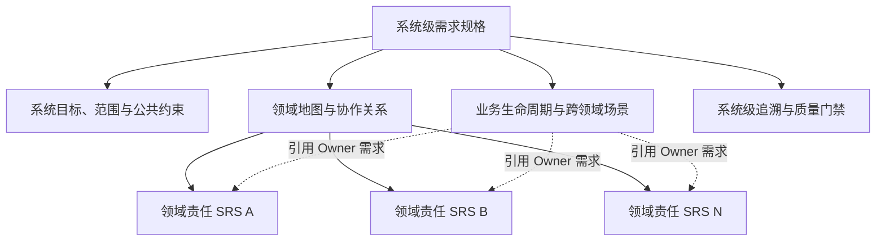

# 项目实施交付管理平台需求规格体系双层结构设计原则

> 设计状态：待用户书面审核<br>
> 设计日期：2026-08-05<br>
> 适用范围：`specs/001-project-delivery-platform/` 需求规格体系重组<br>
> 资料边界：仅使用当前工作区、当前会话及用户明确指定的资料，不使用项目记忆<br>
> 当前交付：只定义规格体系与领域识别原则，不在本文件中锁定领域数量、领域名称或实际需求迁移结果

## 1. 背景与目标

当前需求规格由一份总体规格、8 份领域分册和若干公共附录组成。现有分册主要沿用项目生命周期、历史功能模块和资料来源进行组织，存在以下问题：

- 项目、客户、合同订单、团队和计划集中在同一分册，核心对象与业务责任混杂；
- 工勘、方案、现场实施、物料、外包和技术公告集中在同一分册，文件过大且变化原因不同；
- 设备资产、工时、服务商、RMA 和技术公告共用一个领域名称，无法形成稳定责任边界；
- 分析能力与通用集成机制混合，经营指标和平台治理规则容易互相覆盖；
- 项目交付、割接和巡检界面按工作路径组织，与需求责任域不是同一分类维度；
- 同一业务规则可能在多个页面或分册中重复描述，后续变更容易产生不一致。

本次重组的目标不是把 8 个领域机械调整为 13 个领域，而是建立一套可复用的规格体系：

1. 用系统场景层保留用户熟悉的生命周期、工作台和跨领域协作；
2. 用领域责任层集中定义业务对象、规则、状态和验收标准；
3. 每项目标需求只有一个权威 Owner，其他领域只通过协作关系引用；
4. 领域数量和命名由业务责任、核心对象及规则内聚度推导；
5. 保持来源、需求、验收、设计和测试之间可审计追溯。

## 2. 已确认决策

|编号|决策事项|结论|
|---|---|---|
|DEC-DSS-001|领域规格交付形态|每个最终领域形成一份可独立评审的完整 SRS|
|DEC-DSS-002|公共平台能力|身份、权限、流程、文件、通知、字典、审计及通用集成治理形成独立的公共能力 SRS|
|DEC-DSS-003|分析与集成边界|经营分析作为独立业务领域；通用集成治理归公共能力，具体业务交互归数据或业务对象 Owner|
|DEC-DSS-004|规格总体结构|采用“系统场景层＋领域责任层”的双层结构|
|DEC-DSS-005|页面组织方式|用户界面可以继续按项目生命周期或任务办理路径编排，不要求与领域目录一一对应|
|DEC-DSS-006|领域数量与命名|不以《13领域需求迁移矩阵》作为约束；根据完整业务证据重新评估、拆分、合并和命名|
|DEC-DSS-007|主要开发资料|Markdown 是需求事实源和主要开发资料；本阶段不生成或修改 Word|
|DEC-DSS-008|基础平台称谓|除技术选型章节外统一使用“基础平台”，不在业务文档中重复具体技术产品名称|

## 3. 输入证据及使用等级

### 3.1 证据优先级

|优先级|证据类型|使用规则|
|---|---|---|
|A|当前会话中用户明确确认的业务决策|直接作为规格体系约束；与旧文档冲突时以新确认决策为准|
|B|原始需求收集表、业务数据表、正式说明文档和经确认的业务细节|作为业务需求和业务规则的主要来源|
|C|当前 148 条来源需求、145 项功能需求及其 BR、DR、AC|作为迁移完整性基线；必须逐项给出迁移处置|
|D|页面 HTML、页面数据 Excel、流程图和原型|用于发现用户场景、可见动作、信息结构和流程门禁；不单独证明后台规则|
|E|领域迁移矩阵、历史归类和既有模块名称|仅作分析参考；每个结论必须回到更高等级证据复核|
|F|目标表结构、迁移模型和技术设计|用于发现对象、关系和一致性缺口；不能直接升级为未经确认的业务事实|

### 3.2 指定参考资料的定位

《13领域需求迁移矩阵.md》只用于提供可能的拆分方向和遗漏检查，不承担以下职责：

- 不决定最终领域数量；
- 不决定最终领域名称和编码；
- 不自动决定某项 FR 的 Owner；
- 不要求业务流程或 FR 编号无条件保持不变；
- 不替代原始需求、页面数据、流程和当前确认决策。

项目交付、割接和巡检 HTML 只证明界面中实际呈现的页面、动作、步骤和可见门禁。示例数据、配色、布局尺寸、图标及原型中的占位内容不作为正式业务需求。原型与其他来源冲突时，记录冲突并按证据优先级处理。

### 3.3 推导和不确定性标记

- 来源直接支持的内容按正式需求编写；
- 合理但未经业务确认的优化标记 `【建议】`；
- 会改变领域边界、业务规则、状态或验收结果的不确定事项标记 `【待确认】`；
- 不为了填满模板或维持领域数量而创造需求；
- 不适用的模板章节保留结构并说明“不适用”及原因。

## 4. 双层规格体系



### 4.1 第一层：系统场景层

系统场景层回答“平台为什么建设、总体范围是什么、用户如何跨领域完成工作”。它包含：

- 系统级目标、范围、角色、术语和非功能约束；
- 推荐业务生命周期和不同项目类型的场景差异；
- 领域地图、数据 Owner、领域依赖和业务协作关系；
- 项目交付工作台、割接工作台、巡检工作台等跨领域场景；
- 页面、场景、领域需求和数据来源的映射；
- 系统级风险、待确认事项及总体追溯索引。

系统场景层不得复制领域 SRS 中的完整业务规则、状态机和验收标准。它只描述场景编排、领域调用顺序、跨领域结果和引用编号。

### 4.2 第二层：领域责任层

领域责任层回答“某一类业务能力由谁负责、管理什么对象、执行什么规则、对外产生什么结果”。每个领域形成一份符合通用 SRS 模板的独立规格，至少包含：

- 领域目标、业务价值、范围和非范围；
- 领域角色、核心场景和责任边界；
- 核心业务对象、业务身份、生命周期和数据 Owner；
- 功能需求、业务规则、数据要求和状态流转；
- 权限、通知、业务留痕及异常处理；
- 与其他领域的业务协作契约；
- 领域适用的非功能要求和可观察验收标准；
- 来源需求、历史需求、场景、设计和测试追溯关系。

领域 SRS 可以独立评审，但“独立”不等于复制公共能力。公共权限、文件、流程、通知等能力只在公共能力 SRS 中定义一次，领域 SRS 写明使用条件和引用编号。

### 4.3 两层之间的权威关系

|内容|权威落位|其他位置的写法|
|---|---|---|
|系统目标、总体范围、全局术语|系统级需求规格|领域 SRS 引用|
|业务对象身份、领域状态和业务规则|对象 Owner 的领域 SRS|系统场景和其他领域只引用编号|
|跨领域办理顺序和页面编排|系统场景层|领域 SRS 只描述自身收到的触发和产生的结果|
|权限、流程、文件、通知等公共机制|公共能力 SRS|业务领域声明所需能力和业务约束|
|领域专属指标|指标来源领域 SRS|经营分析领域引用口径|
|跨领域经营指标与组合分析|经营分析领域 SRS|来源领域提供明细或发布口径|
|具体测试步骤和执行证据|TAS|SRS 只保留可观察的业务验收结果|

## 5. 领域识别原则

### 5.1 领域成立条件

一个候选领域应同时具备以下主要特征：

1. 有稳定、可说明的业务目的和责任结果；
2. 拥有至少一个核心业务对象、核心规则集合或权威状态；
3. 能明确指出业务责任角色和最终决策责任；
4. 具有相对完整的生命周期、不变规则或一致性边界；
5. 与其他候选领域之间可以用清晰的输入、输出和业务事件协作；
6. 内部需求通常因相同业务原因一起变化，外部变化不要求复制其内部规则。

只满足“有一个菜单”“有一张页面”“属于一个生命周期阶段”“来自一个外部系统”或“当前有一个模块”的内容，不足以单独构成领域。

### 5.2 应拆分的信号

- 同一文件中存在多个互不相同的核心对象 Owner；
- 不同功能由不同业务部门承担最终责任；
- 状态机、审批依据和一致性规则互不相同；
- 一部分能力可以独立演进或被多个场景重复使用；
- 文件内容经常以“顺便处理”“同时维护”“从另一模块复制”为连接方式；
- 修改一类规则时不应迫使其他规则同步变更。

### 5.3 应合并的信号

- 候选能力围绕同一核心对象及同一生命周期工作；
- 使用相同的业务术语、角色、规则和状态；
- 分开后只能通过大量同步字段维持一致；
- 一个候选仅是另一个领域的操作步骤、查询视图或审批环节；
- 独立后没有明确责任结果，只形成过小的技术或页面分组。

### 5.4 不作为领域边界的因素

- 页面菜单、顶部标签或前端路由；
- 当前 Markdown 文件数量；
- V1、V2、V3 等版本标签；
- 数据库表数量或代码模块数量；
- 外部系统名称；
- 审批流数量；
- 单纯的生命周期先后顺序。

## 6. 领域命名与编码原则

### 6.1 命名原则

- 使用业务人员能够理解且相对稳定的业务名词或能力名称；
- 名称应表达责任范围，不使用含义过宽的“综合管理”“资源管理”等词，除非已定义清晰边界；
- 不直接以页面、组织部门、外部系统、数据库表或技术组件命名；
- 同一概念存在“客户／用户单位”“设备／资产”等多种叫法时，先建立术语映射，再确定正式名称；
- 领域名称可以在分析阶段调整，最终基线后才固定。

### 6.2 编码原则

- 领域编码在领域边界确认后分配，避免先有缩写再迁就含义；
- 编码采用短、稳定、唯一的英文大写缩写；
- 旧领域编码只作为迁移来源，不自动成为新领域编码；
- 公共能力在业务文档中统一称为“基础平台”，具体技术产品名称只允许出现在技术选型章节。

## 7. 需求 Owner 与跨领域协作

### 7.1 单一 Owner

每项目标 FR、BR、DR 和 AC 必须只有一个权威 Owner。Owner 的判断顺序为：

1. 谁拥有核心业务对象或权威状态；
2. 谁对规则正确性和最终业务结果负责；
3. 谁决定异常处理、撤销和补偿；
4. 谁能在不复制其他领域内部规则的情况下完成该能力。

页面展示方、流程发起方、数据消费者和通知接收方不自动成为需求 Owner。

### 7.2 业务协作契约

跨领域协作在 SRS 中使用业务语言定义，不提前固定 API 路径、消息中间件或物理表。每个协作关系至少说明：

|字段|说明|
|---|---|
|协作编号|唯一的业务协作标识|
|发起领域|产生业务触发的一方|
|Owner 领域|执行权威规则并产生结果的一方|
|业务触发|什么业务事实导致协作发生|
|输入语义|需要提供的业务对象、身份和上下文|
|输出语义|成功后可依赖的业务结果|
|失败结果|拒绝、超时、待处理或补偿时的业务表现|
|一致性要求|即时、最终一致或人工确认等业务期望|
|权限边界|发起、查看和处理结果所需的业务权限|
|追溯来源|对应 REQ、FR、BR、AC 和场景编号|

### 7.3 聚合视图

用户资产全景、项目总体跟踪等页面属于跨领域聚合视图。聚合视图可以拥有页面查询、筛选和下钻需求，但不能取得被展示对象的业务规则和主数据所有权。例如：

- 客户或用户单位由客户关系领域维护；
- 项目由项目治理领域维护；
- 设备由设备资产领域维护；
- 服务记录由持续服务领域维护；
- 故障记录由对应服务或外部问题系统提供；
- 聚合页面只负责按权限组织和呈现这些信息。

## 8. 页面与领域的关系

### 8.1 页面保持场景导向

项目交付界面可以继续按“基本信息、工前准备、施工计划、实施方案、实施部署、验收交维”组织；割接界面可以按“采集、分析、申请、审批、跟踪闭环”组织；巡检界面可以按“准备、在线或离线执行、报告、整改、闭环”组织。

这些页面路径服务于用户完成工作，不决定后台业务责任边界。同一页面可以组合多个领域，但页面中的每项业务动作和数据都必须能回到唯一 Owner。

### 8.2 页面证据转换规则

|原型内容|需求处理|
|---|---|
|页面名称、可见字段和业务按钮|与其他来源一致时可作为场景或功能证据|
|按钮禁用、状态提示和可见流程门禁|回查正式资料后形成业务规则或验收标准|
|页面间带入、跳转和聚合关系|形成页面—场景—领域映射及数据来源要求|
|示例项目、人员、时间和统计数字|仅作为演示数据，不进入正式需求|
|颜色、图标、固定布局和原型文案|除非有明确来源，否则不作为确定性需求|
|页面中的“待完善”区域|记录为证据缺口，不自动创造功能|

### 8.3 页面映射要求

每个正式页面或场景应形成一条映射记录：

`页面／场景 → 用户目标 → 主场景 Owner → 参与领域 → 调用 FR → 数据 Owner → 失败表现 → 验收入口`

页面映射用于避免需求重复，不代替领域 SRS。

## 9. 需求迁移与编号策略

### 9.1 不丢失原则

- 148 条来源需求是来源覆盖基线，不因重组而减少或静默消失；
- 当前 145 项 FR 是迁移审计基线，每项必须给出明确处置；
- 最终 FR 数量可以因需求原子化、拆分或合并而变化，不能为了保持 145 而继续保留跨域复合需求；
- 迁移矩阵中的已归类项也必须重新验证，不直接视为已批准结论。

### 9.2 迁移处置类型

|处置|适用情况|目标要求|
|---|---|---|
|KEEP|语义原子且 Owner 未变化|保留编号、名称和追溯|
|MOVE|语义原子但 Owner 调整|默认保留编号并记录新 Owner；是否换用新领域编号由编号评审统一决定|
|SPLIT|一个旧 FR 包含多个独立责任或验收结果|拆成多个目标 FR，全部回溯原 REQ 和旧 FR|
|MERGE|多个旧 FR 实际表达同一行为或同一验收结果|合并为一个目标 FR，保留全部旧 FR 追溯|
|REFERENCE|内容只是公共能力或其他领域规则的重复描述|删除重复定义，改为引用权威编号|
|DEFER|来源明确但不属于当前建设范围|保留来源和理由，进入后续范围，不写成当前承诺|
|REJECT|无可靠来源、纯原型占位或技术假设|记录排除依据，不进入目标规格|

### 9.3 编号稳定性

- `REQ-*` 作为来源标识保持稳定；
- 仅移动文件且语义不变时，优先保持现有 FR、BR、DR、AC 编号；
- 发生 SPLIT 或 MERGE 时允许建立新的目标编号，但必须保留 `legacy_id` 和完整映射；
- 不为了让编号前缀与新领域名称美观一致而批量重编号；
- 编号调整方案必须在领域清单确认后统一处理，不能边迁移边临时决定。

## 10. 目标文档结构

```text
specs/001-project-delivery-platform/
├─ README.md                         # 规格入口、阅读顺序和基线状态
├─ system/
│  ├─ 00-system-srs.md              # 系统级目标、范围、角色、生命周期和公共约束
│  ├─ domain-map.md                 # 领域识别结论、Owner 和依赖关系
│  └─ scenario-orchestration.md     # 项目交付、割接、巡检等跨领域场景
├─ domains/
│  ├─ <domain-code>-<name>-srs.md   # 每个领域一份完整 SRS
│  └─ ...
└─ appendices/
   ├─ source-ledger.md              # 来源、证据等级、位置和冲突记录
   ├─ requirement-migration.md      # 旧需求到目标需求的处置矩阵
   ├─ domain-collaboration.md       # 跨领域业务协作契约
   ├─ page-domain-mapping.md        # 页面、场景、FR 和数据 Owner 映射
   ├─ data-dictionary.md            # 统一业务术语及对象定义
   └─ acceptance-traceability.md    # 来源到验收的全局追溯索引
```

这是目标职责结构，不要求一次性物理移动全部历史证据文件。DDL、迁移脚本、API 设计等技术资料应继续保持独立，不进入领域 SRS 正文。

## 11. 编制顺序

1. 建立来源台账，记录原始需求、页面、流程、当前规格和确认决策；
2. 将现有复合需求原子化，识别业务对象、规则、状态和验收结果；
3. 按业务责任和一致性边界形成候选领域，不预设数量；
4. 评审候选领域的拆分、合并、名称、编码和 Owner；
5. 对 145 项旧 FR 建立 KEEP、MOVE、SPLIT、MERGE、REFERENCE、DEFER 或 REJECT 处置；
6. 先编写系统级 SRS、领域地图和协作关系，再编写各领域 SRS；
7. 建立项目交付、割接和巡检的页面—场景—领域映射；
8. 更新全局数据字典、状态引用和验收追溯；
9. 执行模板结构、编号、来源、Owner 唯一性和交叉重复检查；
10. 通过业务评审后建立新需求基线。

## 12. 质量门禁

### 12.1 完整性

- 148 条来源需求均有目标需求、延期或排除结论；
- 145 项当前 FR 均有唯一迁移处置；
- 所有目标 FR 均有来源、Owner、版本范围、优先级和验收标准；
- 所有已承诺功能均可追溯到业务场景和验证路径。

### 12.2 唯一性

- 每个目标 FR、BR、DR、AC 只有一个权威定义位置；
- 每个核心业务对象只有一个数据 Owner；
- 同一状态和业务口径不在多个领域重复维护；
- 聚合视图不复制来源领域的维护规则。

### 12.3 边界

- 系统场景层不复制领域详细规则；
- 领域 SRS 不包含物理表、代码类、部署脚本或未经确认的 API 路径；
- 验收标准只描述可观察业务结果，不混入测试执行步骤；
- 通用平台能力在公共能力 SRS 定义一次。

### 12.4 标记与术语

- 所有推导内容均标记 `【建议】`；
- 所有会影响范围、规则或验收的不确定事项均标记 `【待确认】`；
- “客户／用户单位”“项目资产库／用户资产库”等术语冲突必须在数据字典中统一；
- 除技术选型章节外统一使用“基础平台”。

### 12.5 自动检查

- 每份领域 SRS 通过模板结构校验；
- 需求编号无重复定义、无悬空引用；
- 来源需求、目标需求和验收追溯不存在缺口；
- 每项目标需求只有一个 Owner；
- 页面映射中的业务动作均能定位到目标 FR；
- Markdown 无模板占位符、空章节和未解释的“不适用”。

## 13. 风险与控制

|风险|影响|控制措施|
|---|---|---|
|把参考矩阵当成最终边界|错误固化领域数量和名称|逐项回查更高等级来源，矩阵只记录参考意见|
|按页面拆领域|同一对象被多个页面重复维护|页面归系统场景层，对象和规则归领域 Owner|
|过度拆分|规格数量过多、协作成本上升|使用领域成立条件和合并信号评审|
|过度合并|文件庞大、责任模糊|使用对象 Owner、状态机和变化原因判断拆分|
|强行保持旧 FR 数量|复合需求继续跨域|允许 SPLIT、MERGE，并保留旧编号追溯|
|批量重编号|开发和验收引用失效|默认保留，确需调整时建立 legacy 映射并统一变更|
|原型内容被误当正式规则|产生无来源承诺|区分页面证据、示例数据和占位内容|
|公共规则在各领域复制|后续修改不一致|公共能力单独成册，其他领域仅引用|

## 14. 下一阶段决策门禁

在开始实际拆分需求规格前，必须完成并确认：

1. 候选领域清单、名称、编码和每个领域的一句话责任；
2. 核心业务对象及数据 Owner 清单；
3. 145 项当前 FR 的完整迁移处置矩阵；
4. 项目交付、割接和巡检页面的主场景 Owner 与参与领域；
5. MOVE、SPLIT、MERGE 时的编号处理方案；
6. 旧目录保留、重定向或归档方式；
7. 系统级 SRS 与领域 SRS 的评审顺序。

## 15. 本设计完成标准

- 双层结构及两层权威边界清晰；
- 领域数量和命名未被参考矩阵预先锁定；
- 领域识别、拆分、合并、命名和 Owner 判断均有明确规则；
- 页面生命周期编排与领域责任划分可以并存；
- 来源需求和当前 FR 均有可执行的迁移审计机制；
- 公共能力、业务领域、分析能力和外部交互的归属原则清晰；
- 后续可据此制定领域评估和规格重组实施计划。
