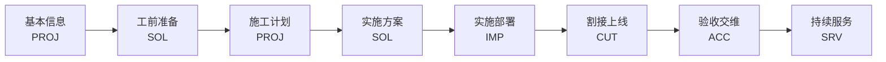
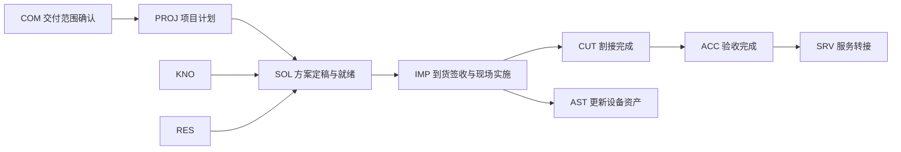

# 项目实施交付管理平台详细需求规格说明书

> 文档状态：已确认基线<br>
> 基线日期：2026-07-28<br>
> 适用版本：V1、V2；V3演进范围<br>
> 资料范围：当前工作区`/需求`的15份原始资料、148条标准化需求及2份补充技术规范<br>
> 记忆使用：未使用项目记忆

## 1. 文档目的

本规格面向产品经理、业务负责人、架构师、前后端开发、测试、数据和运维人员，作为产品设计、开发估算、接口设计、测试验收和范围控制的共同基线。

## 2. 建设目标

- 建立项目承接、准备、计划、实施、割接、验收、闭环和持续服务的一体化PMS核心平台。
- 以项目为交付治理聚合根，打通任务、设备、风险、问题、文档、交付物和客户服务。
- 通过可配置生命周期支持标准交付、复杂工程、POC、独立割接、主动巡检和维保续保。
- 建立可追溯的阶段门禁、审批、审计和验收证据链。
- 在模块化单体中保持业务域边界，为未来多端和微服务拆分保留稳定契约。

## 3. 成功标准

- 148条标准化需求全部具有唯一版本归属和领域归属。
- 所有V1、V2功能均可追溯到来源需求并具备可测试验收标准。
- 项目和任务支持非固定层级，10万项目、500万任务规模下满足本规格性能基线。
- 核心业务闭环通过真实数据库、真实接口和真实权限完成集成验收。
- 任何【待确认】规则在开发前形成明确决策，不由开发人员自行猜测。

## 4. 范围与版本

| 版本 | 处理规则 | 需求数量 |
| --- | --- | --- |
| V1 | P0核心能力及平台基础性能基线，形成项目交付、割接、巡检和闭环的最小完整闭环 | 70 |
| V2 | P1/P2效率提升、扩展治理和运营能力，逐项详细规格 | 71 |
| V3 | P3智能化与探索能力，仅定义范围、数据前提、人工复核和风险边界 | 7 |

优先级分布：P0 69条、P1 51条、P2 21条、P3 7条。

## 5. 已确认技术基线

| 编号 | 主题 | 约束 |
| --- | --- | --- |
| DEC-001 | 规格体系 | 采用“总体规格总册 + 13个领域分册 + 公共附录”；正式 FR 在唯一 Owner 领域完整定义。 |
| DEC-002 | 版本范围 | V1、V2逐项详细规格；V3仅定义能力边界、数据前提和演进方向。 |
| DEC-003 | 基础平台 | 以`yudao-boot-mini`的`master-jdk25`为最简集成基线；当前核验版本为JDK 25、Spring Boot 4.1.0、revision `2026.06-jdk25-SNAPSHOT`。 |
| DEC-004 | 部署形态 | 首期模块化单体，由yudao-server统一部署；保留未来微服务拆分边界。 |
| DEC-005 | 管理端 | Vue3 + Element Plus，响应式布局优先。 |
| DEC-006 | 租户策略 | 首期单租户运行，数据模型和接口上下文保留多租户扩展能力。 |
| DEC-007 | 认证策略 | V1使用Yudao本地账号，预留LDAP、AD、OAuth2/SSO扩展。 |
| DEC-008 | 核心数据 | 本平台自身就是PMS核心系统，PMS不是外部集成系统。 |
| DEC-009 | 多端策略 | 首期只承诺响应式Web；后续扩展移动端和桌面客户端。 |
| DEC-010 | 项目层级 | 项目支持非固定层级树，项目组合与项目父子层级分离。 |
| DEC-011 | 任务层级 | 任务使用非固定层级WBS，不设置固定业务深度。 |
| DEC-012 | 容量基线 | 10万级项目、500万级任务、500人级同时在线。 |
| DEC-013 | 模块边界与命名 | 基础平台只承载平台能力；项目交付业务模块统一使用`pms-module-*`命名，通过`-api`契约或领域事件协作。 |
| DEC-014 | API设计 | 基础平台接口定义以上游平台为准；项目交付目标契约通过适配层把公司和部门统一为`company_*`与`department_*`，不得向新业务契约暴露`org_*`或`organization*`；新增`pms-module-*`业务模块统一执行项目交付业务、内部、集成和事件API规范，接口必须版本化并具备稳定契约编号。 |
| DEC-015 | 双上游集成策略 | 以`yudao-boot-mini`保持最简根工程；mini缺失但项目交付需要的基础平台模块从`YunaiV/ruoyi-vue-pro`同名版本分支获取。共享文件以mini为基线，扩展模块及其配套资产以完整仓库为来源，项目交付业务模块在根级增量加入。 |
| DEC-016 | 数据库与旧库边界 | 新平台使用独立MySQL 8.x数据库；旧`dppms`只读访问且不得跨库SQL；业务数据一次性迁移，后续辅助关联数据只读同步。 |
| DEC-017 | 身份与项目授权 | 公司是统一业务主体，租户与公司分离；部门主数据共享，公司—部门配对在具体业务关系中保存；员工目录与系统账号分离；外部账号按项目转派获得期限受控的菜单、操作、数据和字段权限。 |
| DEC-018 | 附加SN关系 | `fb_shipment_barcode_relation`按合同保存主SN—附加SN权威历史；设备主档只缓存该SN最新发货合同对应的`secondary_sn/secondary_item`，不重复保存合同、关系和生效时间。 |
| DEC-019 | 历史字段完整迁移 | 核心迁移同时保存完整来源载荷和正式业务列/关系；查询、关联、统计、同步和来源审计字段不得只存JSON，旧主键不得复用为目标主键，未映射字段阻断切换。 |

### 5.1 上游基线来源

- 最简基础仓库：[`yudao-boot-mini`](https://gitee.com/yudaocode/yudao-boot-mini)，分支`master-jdk25`，本次核验提交`e6d814cb59cfc204f02aa2516799073382aba801`，对应标签`v2026.06(jdk25)`。
- 扩展模块仓库：[`YunaiV/ruoyi-vue-pro`](https://github.com/YunaiV/ruoyi-vue-pro)，分支`master-jdk25`，本次核验提交`a6558325b0f09017f531f1e5891613ef9b468132`。
- 版本兼容基准：两个仓库根POM当前均为revision `2026.06-jdk25-SNAPSHOT`、JDK 25、Spring Boot 4.1.0。
- 核验依据：[`mini根POM`](https://gitee.com/yudaocode/yudao-boot-mini/blob/master-jdk25/pom.xml)、[`完整仓库根POM`](https://github.com/YunaiV/ruoyi-vue-pro/blob/master-jdk25/pom.xml)、[`完整仓库BPM模块`](https://github.com/YunaiV/ruoyi-vue-pro/tree/master-jdk25/yudao-module-bpm)。

实际开始代码集成时必须同时记录两个上游提交，不得只记录“最新master-jdk25”。后续升级通过独立变更评审执行；禁止用完整仓库整体覆盖mini中的同名基础模块。

<!-- LANDSCAPE -->

## 6. 业务生命周期

| 编号 | 阶段 | 目标 | 主要活动 | 输入 | 输出 | 完成标准 |
| --- | --- | --- | --- | --- | --- | --- |
| L1 | 任务承接与项目组织 | 形成可治理的交付对象和责任体系 | 项目同步/创建、分类分级、拆分合并、人员指派、启动 | 订单、合同、销售/服务任务、客户设备数据 | 项目主数据、项目类型、团队、初始范围 | 项目唯一、责任明确、模板确定、必要数据完整 |
| L2 | 交付准备与需求基线 | 确认现场条件、客户需求和交付边界 | 工勘、客户联系人、需求分析、风险识别、物料及授权准备 | 项目主数据、设备清单、客户需求 | 工勘结果、需求基线、风险台账、资源缺口 | 关键需求确认，阻断性现场/物料问题已有处置 |
| L3 | 计划、方案与资源就绪 | 形成可审批、可执行的计划和技术方案 | 工期倒排、实施方案、脚本、资源/备件、方案分级审核 | 需求基线、工勘、合同工期、模板 | 计划基线、审核通过方案、资源清单 | 方案审批通过，人员物料工具窗口就绪 |
| L4 | 到货、安装与配置实施 | 完成设备实体部署和基础技术配置 | 到货签收、上架加电、配置调试、质量与安全检查、问题整改 | 设备与物料、实施方案、现场条件 | 安装记录、配置Log、自检结果、实施问题 | 设备部署完成，基础配置达标，阻断问题关闭 |
| L5 | 业务联调、割接与稳定观察 | 使业务在目标环境稳定运行 | 业务联调、割接风险评估、方案审批、窗口执行、回退、稳定观察 | 配置结果、业务测试标准、割接窗口 | 联调结果、割接记录、业务验证、遗留项 | 业务验证通过或已安全回退，遗留项责任明确 |
| L6 | 验收、移交与项目闭环 | 完成客户确认、资料移交和管理闭环 | 培训、完工证明、满意度、初终验、交付件检查、闭环审批/回访 | 实施与测试证据、合同验收要求 | 验收材料、客户评价、归档包、闭环结论 | 必交材料齐全，审批及回访通过，资产可转维保 |
| L7 | 维保服务与资产持续运营 | 持续保障设备健康并经营续保机会 | 巡检、故障/RMA、公告治理、主动服务、过保与续保跟踪 | 设备资产、维保期限、客户等级、历史服务 | 巡检报告、服务记录、治理结果、续保任务 | 服务任务闭环，资产状态持续更新 |

### 6.1 阶段设计规则

- 阶段由项目类型模板决定，可跳过可选阶段，但跳过动作必须可追溯。
- 割接是L5内的专业子流程；巡检主要属于L7持续服务，不强制所有交付项目执行。
- 阶段完成必须通过数据、交付物、问题和审批门禁。
- 项目关闭不等于删除，关闭后核心业务数据只读。

## 7. 项目类型

| 项目类型 | 适用场景 | 阶段模板 | 特点 |
| --- | --- | --- | --- |
| 售前测试/POC | 借货测试、试用验证、周期短 | L1 → L2（精简）→ L4（配置/联调）→ L6（轻量闭环） | 不强制完整到货验收和正式终验；关注测试记录、借货和临时授权 |
| 标准设备交付 | 单区域、标准产品、常规实施 | L1 → L2 → L3 → L4 → L5（按需）→ L6 → L7 | 采用标准里程碑和交付件；无割接时跳过L5中的割接子流程 |
| 复杂工程/多节点项目 | 跨办事处、多订单、多团队、重大项目 | L1 → L2 → L3 → L4/L5分批次迭代 → L6 → L7 | 一级项目汇总、子项目并行、重大方案复审、分批验收和整体终验 |
| 独立割接服务 | 升级、替换、变更、演练或故障后割接 | 任务创建 → 风险调研 → 等级评估 → 方案审批 → 执行/回退 → 观察归档 | 可关联既有项目/设备/ITR，也可自建；A-D级决定流程强度 |
| 主动巡检服务 | 维护期健康检查、专项排查 | 任务创建 → 准备 → 在线/离线执行 → 报告 → 待办整改 → 闭环 | 规则驱动，可批量执行；问题可转工单或下次巡检 |
| 维保续保项目 | 设备过保提醒、客户关怀、续保经营 | 资产识别 → 机会/任务下发 → 回访跟踪 → 报价/合同 → 续保闭环 | 以客户—项目—设备空间为对象，不复用工程实施全流程 |

<!-- PORTRAIT -->

## 8. 领域架构

| 领域代码 | 领域名称 | Owner责任 | 正式FR数 |
| --- | --- | --- | --- |
| PLT | 平台公共能力 | 身份、权限、流程、文件、通知、审计、字典和通用集成治理 | 12 |
| CUS | 客户与服务关系 | 客户交付上下文、联系人和服务等级 | 5 |
| PROJ | 项目治理 | 项目主档、组合、非固定层级项目树与任务WBS、团队、计划、风险和关闭控制 | 13 |
| COM | 合同订单履约 | 合同、订单、交付范围及履约回写 | 2 |
| SOL | 交付准备与方案 | 工勘、需求分析、交底、准备数据、实施方案、资源就绪和方案基线 | 15 |
| IMP | 现场实施 | 实施变更、到货签收、安装、配置、联调、现场问题、质量与安全 | 8 |
| CUT | 变更切换与稳定治理 | 割接准备、评估、方案、审批、执行、回退、观察和闭环 | 10 |
| ACC | 验收与项目闭环 | 培训、满意度、验收、交付件、关闭审批和持续服务交接 | 12 |
| AST | 资产管理 | 设备身份与档案、配置记录、RMA衔接及维保客观信息 | 10 |
| RES | 资源与外包 | 服务商、外包申请审批、付款条件和资源协作 | 7 |
| SRV | 服务运营 | 服务工单、割接保障工单、巡检任务及服务状态提示 | 16 |
| KNO | 技术知识治理 | 当前承接技术公告同步；公告治理闭环保留为V3演进 | 1 |
| ANA | 经营分析 | 项目组合经营、工时人效和跨领域只读分析 | 4 |

正式需求逐项Owner以`需求/PRD-项目实施交付管理平台.md`及`domains/`下13份领域规格为准，当前共115项；FR、BR、DR、AC的历史编号保持不变，编号前缀仅用于追溯，不再等同于当前Owner领域代码。

### 8.1 模块边界

- 领域是业务责任边界，不直接等同于物理部署模块。
- 每项 FR、BR、DR、AC 和核心业务对象只有一个 Owner；Consumer 领域只记录依赖对象、输入、输出和事件。
- 页面允许聚合多个领域的只读或操作视图，任何聚合页面不得改变源对象 Owner。
- 领域间通过稳定契约或领域事件协作，禁止直接操作其他领域业务表。
- 具体模块命名、依赖和技术选型见 `appendices/module-boundary-and-naming.md` 及本规格技术选型章节。

### 8.2 项目交付生命周期界面编排



客户信息由 CUS 提供，合同范围由 COM 提供，设备清单由 AST 提供，资源投入由 RES 提供，技术风险由 KNO 提供，经营视图由 ANA 聚合。项目详情页属于应用层编排，不构成新的业务领域。

### 8.3 割接与服务工作台

- 割接工作台由 CUT 拥有，可由项目、故障、运维变更或主动服务触发；依次编排任务、风险评估、方案评审、执行窗口、回退、稳定观察和归档。
- 服务工作台由 SRV 拥有，编排巡检计划、任务、在线或离线采集、问题确认、整改跟踪、服务报告、服务工单和维保活动。

### 8.4 跨领域页面—Owner—数据来源

| 页面区域 | 展示内容 | Owner | 数据来源 |
| --- | --- | --- | --- |
| 项目基本信息 | 项目名称、阶段、项目树 | PROJ | Project |
| 客户信息 | 客户单位、联系人、服务等级 | CUS | CustomerContext |
| 合同信息 | 合同号、订单行、交付范围 | COM | OrderLine |
| 设备清单 | SN、型号、位置、资产状态 | AST | Asset |
| 实施状态 | 到货签收、安装、调试、联调 | IMP | Implementation |
| 割接状态 | 窗口、审批、执行和观察结果 | CUT | Cutover |
| 验收状态 | 初验、终验、关闭和转维 | ACC | Acceptance |
| 服务状态 | 巡检、工单、维保和续保 | SRV | Service |

### 8.5 生命周期事件与依赖



建议事件包括 `SolutionFinalized`、`ImplementationCompleted`、`AssetInstalled`、`CutoverCompleted`、`AcceptanceCompleted` 和 `ServiceTransitionCreated`；事件字段、失败补偿及幂等规则【待确认】，不得在领域 SRS 之外提前固化。

## 9. 项目组合、项目层级与任务WBS

### 9.1 概念区分

- 项目组合：管理和经营分析分组，一个项目可按规则加入多个组合，不产生父子关系。
- 项目层级：复杂交付的业务分解关系，子项目可独立计划、实施、验收和闭环。
- 关联项目：扩容、续采、改造、维保等非层级关联。
- 任务WBS：项目内部的执行分解结构，与项目层级相互独立。

### 9.2 非固定层级规则

- 项目与任务不设置固定业务深度，不设计`level1_id`、`level2_id`等字段。
- 使用`parent_id + path + depth + sort`表达树结构；技术保护阈值允许配置但不得成为业务固定层级。
- 禁止循环引用，禁止将节点移动到自身或自身后代下。
- 支持整棵子树移动，移动后重新计算路径、权限、汇总和缓存。
- 上级节点能够汇总全部后代的进度、工时、风险、问题、设备和交付物。
- 子节点未完成时，上级节点默认不得闭环；例外需要审批并形成遗留项。
- 存在子节点或业务记录的节点禁止物理删除。

## 10. 核心业务对象

| 对象 | 说明 | 生命周期 |
| --- | --- | --- |
| 客户/用户单位 | 服务对象及资产归属主体 | 同步/创建 → 分级 → 服务 → 续保/失效 |
| 联系人 | 客户沟通、签署和评价参与人 | 创建 → 主次标识 → 更新 → 失效 |
| 项目 | 实施交付治理主体，可多级多节点 | 承接 → 准备 → 实施 → 验收 → 闭环 → 维护 |
| 项目阶段/里程碑 | 生命周期控制点及进度基线 | 计划 → 执行 → 校验 → 完成/回退 |
| 设备/序列号 | 交付与维保资产最小追踪单元 | 发货 → 安装 → 配置 → 在网 → 维保 → 替换/退役 |
| 任务/待办/工单 | 人员需要执行的具体事项 | 创建 → 分派 → 处理 → 审核/验证 → 关闭 |
| 方案/计划 | 项目或割接的可执行基线 | 草稿 → 评审 → 发布 → 变更 → 归档 |
| 交付件/文件 | 阶段完成和验收证据 | 生成/上传 → 校验 → 审核 → 归档 |
| 风险/问题/遗留项 | 影响交付成功的异常对象 | 识别 → 分级 → 处置 → 验证 → 关闭/转移 |
| 割接任务 | 生产变更及业务切换控制对象 | 准备 → 评估 → 审批 → 执行/回退 → 观察 → 归档 |
| 巡检任务/规则/结果 | 设备健康检查及问题发现对象 | 准备 → 执行 → 报告 → 确认 → 整改 → 闭环 |
| 维保空间/续保任务 | 设备服务期限和续保机会集合 | 识别 → 下发 → 跟踪 → 转化/关闭 |
| 服务商/转包/付款 | 外部交付和费用结算对象 | 准入 → 申请 → 审批 → 履约 → 回访 → 付款 |
| 技术公告 | 产品风险及治理要求 | 编写 → 会签 → 发布 → 命中 → 治理 → 统计 |

## 11. 角色模型

| 角色 | 职责 | 关注重点 | 系统权限 |
| --- | --- | --- | --- |
| 工程管理部/平台运营 | 项目分类、重大项目识别、服务经理指派、流程模板治理 | 全国项目、超期、资源和质量 | 全国数据及项目治理权限 |
| 服务经理 | 项目承接、项目经理指派、计划/方案/闭环审批、客户关系 | 办事处组合、工期风险、满意度 | 区域及授权全国检索、审批权限 |
| 项目经理 | 计划、方案、团队、实施、验收和闭环 | 范围、工期、质量、交付件、风险 | 本人负责项目读写及团队授权 |
| 一线/现场工程师 | 工勘、安装、配置、联调、割接、巡检和记录 | 待办、操作清单、设备数据、问题 | 被指派项目/任务操作权限 |
| 二线/研发/产品线 | 技术评审、远程保障、故障和公告治理 | 方案风险、版本兼容、重大异常 | 按产品线、区域或被指派任务访问 |
| 回访/维保人员 | 满意度、项目回访、过保关怀、续保跟踪 | 客户反馈、设备在网、续保意向 | 分配客户/任务及必要资产信息 |
| 外协/驻场/服务商 | 在授权范围内执行现场或维护工作 | 任务、材料、工时和付款条件 | 仅授权项目/设备/功能，期限受控 |
| 客户联系人 | 确认需求、测试、培训、评价和验收 | 业务影响、服务质量、交付资料 | 链接/门户的有限填写和查看权限 |
| 审批人/管理层 | 重大项目、割接、转包和例外审批 | 风险、成本、时效、合规 | 待审批对象及管理报表 |
| 系统/流程管理员 | 组织、角色、字典、模板、规则、集成和审计 | 稳定性、安全、配置一致性 | 平台配置和受控运维权限 |

## 12. 公共业务规则

- 所有业务对象必须具有唯一标识、状态、版本、创建人、创建时间、修改人和修改时间。
- 所有状态变化必须由显式业务动作触发，禁止通过普通编辑直接修改状态字段。
- 审批通过的方案、计划、验收和关键文档形成不可覆盖的版本基线。
- 删除默认为逻辑删除；已发生审批、执行、验收或财务影响的数据不得删除。
- 文件下载、批量导出、权限变更和敏感数据访问必须记录审计。
- 通知和待办由业务事件触发，需具备模板、接收人规则、去重、重试和已读状态。
- 导入和接口请求必须使用业务唯一键或幂等键，重复请求不得生成重复业务对象。
- 【建议】跨系统业务对象的唯一身份可由多个业务属性共同确定，不得默认把合同号、订单号或名称等单一字段作为全局唯一键。
- 【建议】发生拆分、合并、转移、替换或归属变化的关系，应保存来源、生效区间和变更原因，不通过覆盖当前值丢失历史。
- 无法唯一映射、数量未知或来源冲突的数据必须保留原始证据并进入明确的待处理状态；未经确认不得猜测、丢弃或计入完成结果。
- 订单数量、ERP已发货数量、项目已确认分配数量和设备SN数量属于不同业务口径，必须分别定义、展示和追溯。
- 【建议】看板汇总和查询快照是可重建的分析结果，不作为项目、订单行、设备或业务事件的权威数据源。

## 13. 非功能需求

| 编号 | 场景 | 验收指标 |
| --- | --- | --- |
| NFR-PERF-001 | 普通列表和详情查询 | P95不超过2秒 |
| NFR-PERF-002 | 新增、修改和状态流转 | P95不超过3秒 |
| NFR-PERF-003 | 项目树或任务树直接子节点加载 | P95不超过2秒 |
| NFR-PERF-004 | 全后代汇总查询 | P95不超过5秒 |
| NFR-PERF-005 | 常规管理报表 | P95不超过10秒 |
| NFR-PERF-006 | 超过10万行的导入导出 | 异步执行并提供进度、结果和失败明细 |
| NFR-AVL-001 | 月度可用性 | 不低于99.9% |
| NFR-DR-001 | 恢复点目标RPO | 不超过15分钟【建议，待运维确认】 |
| NFR-DR-002 | 恢复时间目标RTO | 不超过2小时【建议，待运维确认】 |
| NFR-SEC-001 | 密码与凭证 | 密码不可明文存储；设备访问凭证不得进入普通业务表或日志 |
| NFR-AUD-001 | 关键业务审计 | 项目、任务、审批、验收、拆分、合并、权限和导出必须留痕 |
| NFR-COMP-001 | 浏览器兼容 | 最新版及前一个主要版本的Chrome、Edge |
| NFR-TEST-001 | 核心业务规则单元测试覆盖率 | 不低于80% |
| NFR-TEST-002 | 新增后端代码行覆盖率 | 建议不低于70% |

## 14. 技术栈

- 后端：以`yudao-boot-mini master-jdk25`为骨架，mini外模块从`YunaiV/ruoyi-vue-pro master-jdk25`按需获取；revision `2026.06-jdk25-SNAPSHOT`、JDK 25、Spring Boot 4.1.0、`yudao-framework`、MyBatis Plus、Spring Security、Flowable/BPM。
- 前端：官方`yudao-ui-admin-vue3`、Vue3、TypeScript、Element Plus，响应式Web；前后端同库或独立仓库方式【待确认】。
- 数据：关系型数据库【待确认具体产品】、Redis；文件服务复用Yudao Infra并支持对象存储。
- API：基础平台接口保持上游定义；新增项目交付业务模块采用RESTful JSON，业务、内部、集成和事件契约分别治理并统一版本化，详见`appendices/api-design-specification.md`。
- 部署：首期模块化单体，预留模块级独立部署能力。

## 15. 开发命令

以下命令作为仓库初始化后的目标命令；实际脚本名需在代码仓库建立后校验。

```text
后端构建：mvn clean package -DskipTests
后端测试：mvn clean test
后端验证：mvn clean verify
后端启动：mvn spring-boot:run -pl yudao-server -am
前端安装：pnpm install
前端开发：pnpm dev
前端构建：pnpm build:prod
前端检查：pnpm lint
```

## 16. 目标项目结构

```text
project-delivery-platform/
├── yudao-dependencies/
├── yudao-framework/
├── yudao-module-system/
├── yudao-module-infra/
├── yudao-module-bpm/                 # 从完整仓库同版本分支获取
├── pms-module-project/
│   ├── pms-module-project-api/
│   └── pms-module-project-biz/
├── pms-module-engineering/
├── pms-module-cutover/
├── pms-module-service/
├── pms-module-asset/
├── pms-module-outsourcing/
├── pms-module-analytics/
├── pms-module-integration/
├── yudao-server/
└── yudao-ui/
    └── yudao-ui-admin-vue3/          # mini基础集成及完整仓库扩展模块增量
```

完整管理端以官方`yudao-ui-admin-vue3`为基础；采用前后端同库还是独立前端仓库【待确认】。每个业务模块内部建议按`controller / service / dal / convert / framework`组织，并在领域较大时进一步按业务子域分包。

## 17. 代码与接口风格

```java
@Transactional
public Long createProject(ProjectCreateReqVO request) {
    projectPolicy.checkCreate(request);
    ProjectDO project = ProjectConvert.INSTANCE.convert(request);
    projectMapper.insert(project);
    projectEventPublisher.publishCreated(project.getId());
    return project.getId();
}
```

- Controller只处理协议、参数校验和权限；业务规则位于应用服务或领域策略。
- DTO/VO、DO、枚举、权限标识和错误码遵循Yudao现有命名方式。
- 跨模块只能依赖目标`pms-module-*-api`或版本化事件，不直接引用对方`-biz`、DAL和数据库表。
- 所有写接口必须明确幂等、并发控制、权限和审计策略。
- 基础平台接口沿用上游路径、请求响应和错误语义；新增项目交付业务接口使用`/api/v1/pms/...`及`{DOMAIN}-{RESOURCE}-{TYPE}-{SEQ}`契约编号。

## 18. 测试策略

- 单元测试：状态机、汇总算法、层级校验、权限策略、门禁和金额/时效规则。
- 集成测试：数据库约束、事务、Flowable流程、文件、Redis和模块API。
- 契约测试：内部API、外部API、事件结构、错误码和幂等。
- 端到端测试：项目承接至闭环、割接回退、巡检整改、项目拆分合并和任务WBS。
- 性能测试：10万项目、500万任务、500在线用户的查询、树加载和汇总。
- 安全测试：越权、批量导出、文件访问、敏感字段、重复提交和审计完整性。

## 19. 研发边界

### 19.1 始终执行

- 变更规格后再变更实现；保持REQ、FR、AC和测试用例追溯。
- 对输入、权限、状态、租户上下文和业务唯一性进行服务端校验。
- 数据库变更使用版本化迁移脚本，禁止依赖人工改库。
- 提交前运行相关单元、集成和构建检查。

### 19.2 变更前确认

- 数据库产品和部署拓扑变更。
- 新增第三方依赖、基础设施组件或跨模块直连。
- 修改公共状态、编码、权限继承、汇总和删除规则。
- 扩大V1/V2范围或把V3能力提前为开发承诺。

### 19.3 禁止执行

- 在代码、配置、日志或文档中提交密码、设备凭证和密钥。
- 绕过权限、状态机、审批或审计直接更新业务表。
- 删除失败测试以换取构建通过。
- 用模拟页面、编译通过或接口文件存在替代真实业务验收。

## 20. 待确认事项

| 问题 | 影响范围 | 确认人 |
| --- | --- | --- |
| 项目阶段的标准顺序和名称最终以哪套口径为准？ | 生命周期、导航、计划、统计、数据迁移 | 工程管理部/产品负责人 |
| 哪些项目类型必须执行割接，哪些仅做业务联调？ | 项目模板和阶段门禁 | 工程管理部/技术支持中心 |
| D级简易割接具体允许跳过哪些采集、方案和审批节点？ | 割接流程与合规 | 技术支持中心/风险负责人 |
| 巡检存在未完成待办时，默认禁止闭环还是转后续任务后允许闭环？ | 巡检闭环与风险 | 售后服务负责人 |
| CRM、SMS、ITR、MES、供应链等外部系统分别是哪类数据的权威源？平台内部各领域的数据所有权如何落表？ | 主数据与集成 | IT架构/各系统Owner |
| 直签、非直签、工程类、普通类、售前测试的判定规则能否固化？ | 项目分类和模板 | 工程管理部/财务/销售运营 |
| 重大项目识别规则与人工覆盖权限如何定义？ | 项目分级和总部复审 | 工程管理部 |
| 项目允许带遗留问题闭环吗？允许时需要哪一级审批？ | 验收、闭环、维保移交 | 工程管理部/质量负责人 |
| 设备远程采集是否允许Telnet，凭据由谁提供和托管？ | 安全、巡检、配置采集 | 信息安全/网络运维 |
| 客户电子签字、签章和问卷结果的法律效力要求是什么？ | 完工证明、验收、付款 | 法务/财务/工程管理 |
| 转包付款是否纳入本平台交易闭环，还是仅同步状态和材料？ | 转包、财务集成范围 | 财务/采购/工程管理 |
| 备件和技术公告是否为本次建设范围，还是只做关联入口？ | 范围、预算、分期 | 项目发起人/产品委员会 |
| 历史项目、设备、交付件和维保数据需要迁移多少年？ | 数据迁移和存储容量 | 业务Owner/IT |
| 外部客户是否需要正式门户，还是仅使用一次性链接完成表单？ | 客户权限与体验 | 售后服务/信息安全 |
| V1上线的验收指标和试点办事处/项目类型是什么？ | MVP验收和推广 | 项目发起人/工程管理部 |
