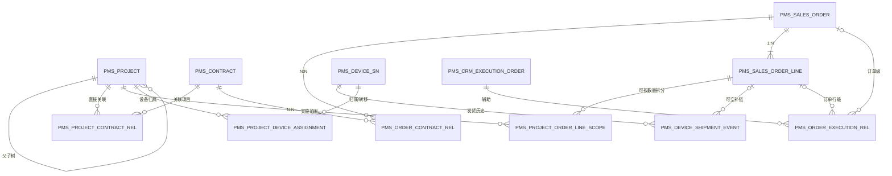

# 项目、合同、订单行与设备SN目标表结构建议

## 1. 结论先行

基于Excel数据字典、旧库DDL与当前数据、SQL XML、Java代码和拆单存储过程，建议采用以下模型：

前序方案及淘汰原因见[《项目、订单与实施范围模型方案回顾》](project-order-model-options-review.md)。

1. 以`项目 → 项目订单行实施范围`作为实施主链。
2. 合同、ERP订单、ERP订单行分别建主档；合同与订单使用N:N关系表。
3. 项目与合同保留直接N:N关系，用于订单生成前的合同项目以及合同维度查询。
4. CRM执行单、执行单配置和特殊合并下单关系只作为可空辅助证据，不作为实施主链必填外键。
5. 订单行上的`已发货数量 = 下单数量 - 未清数量`保留为ERP同步值；设备SN另建事实模型，不用SN数量替代ERP发货数量。
6. SN主档、发货事件和SN项目归属必须分表。当前数据可以迁移SN到项目的归属，但不能把SN批量强行补到ERP订单行。
7. 项目树使用规格已确定的`parent_id + root_id + path + depth + sort`；项目组合另建组合成员表，不复用旧`pm_project_group`。
8. 查询项目及其实施订单只需走有索引的`项目范围 → 订单行 → 订单`，不需要复制旧系统的多表宽连接。项目列表先分页，再查询关系和汇总。
9. 对无法唯一映射、缺少分配数量和重复的历史记录，保留原始快照并进入迁移问题表；不得通过截取`-L`、`-his`或按最新一条记录猜测。

因此，前一文档中的“方案四：ERP订单行实施范围模型”可以确定为目标核心模型，但必须增加两个迁移状态：

- `PENDING_MAPPING`：历史项目产品记录暂时不能唯一命中ERP订单行。
- `PENDING_QUANTITY`：项目与订单行归属已知，但跨项目分配数量尚不能从旧数据恢复。

## 2. 证据范围与约束

### 2.1 数据来源

| 来源 | 核验方式 | 本文用途 |
| --- | --- | --- |
| `需求/数据元.xlsx` | 直接读取工作簿单元格和隐藏列信息，未使用截图 | 核对旧表字段语义 |
| `localhost:3306/dppms` | 仅执行`SELECT`、`SHOW`；最新统计快照为2026-08-04 10:26至10:55 | 核对真实数量、重复、缺失和关联基数 |
| `sql-map-project-config.xml` | 读取SQL定义 | 核对项目、合同、订单行、SN及转移的实际用法 |
| `sql-map-project-common-config.xml`及刷新SQL | 读取SQL定义 | 核对ERP数量刷新和项目产品行维护 |
| `ProjectServiceImpl.java` | 读取代码 | 核对合并、拆分和事务行为 |
| `splitSoleAgentLendOrderInfo` | `SHOW CREATE PROCEDURE` | 核对`-L`特殊拆单、真实执行单和RMA更新 |
| 现行规格 | 读取Markdown | 核对项目树、组合分离、性能和审计要求 |

Excel中重点核验的范围包括：

- `项目管理!A17:S58`：`pm_project`
- `项目管理!A61:S89`：项目合同、项目组及项目组关系
- `项目管理!A164:S175`：`pm_project_product_line`
- `系统支撑!A704:R719`：ERP订单头
- `系统支撑!A773:R788`：ERP订单行
- `系统支撑!A1029:R1060`：常规CRM执行单
- `系统支撑!A1097:R1139`：安服补充执行单信息
- `系统支撑!A1211:R1230`：安服产品配置
- `系统支撑!A1255:R1264`：特殊业务合并下单关系

### 2.2 设计边界

- 新平台是独立MySQL 8.x数据库。
- 迁移程序分别连接旧库和新库，不使用跨库SQL。
- 旧业务主数据一次性迁移；后续CRM/ERP辅助数据通过只读采集同步。
- 本文给出逻辑表结构、关键列和索引，不是可直接执行的最终建表脚本。
- 数量字段目前在旧库为`int`。目标是否允许小数单位，需要在物料单位规则确认后决定使用`BIGINT`还是`DECIMAL(18,4)`。

## 3. 旧库事实与设计影响

### 3.1 项目、项目组和合同

| 事实 | 当前数据 | 设计影响 |
| --- | ---: | --- |
| `pm_project`记录数 | 83,550 | 从基表迁移，不从视图迁移 |
| `(projectType, projectCode)`重复 | 165组、177条多余记录；21组存在多条当前有效记录 | 新库唯一约束启用前必须处理，不得静默覆盖 |
| `pm_project_header` | `projectType='10'`的可更新视图 | 不能作为独立迁移表 |
| `pm_project_group`名称为空 | 83,555 / 85,496 | 旧项目组主要是技术桥，不是项目组合 |
| `pm_project_contract` | 86,780行；34组重复、47条多余记录 | 迁移关系需去重并保留来源映射 |
| 同一合同号关联多个旧项目组 | 2,800个合同号，最多关联9组 | 合同号不能作为合同主键 |
| `pm_project_group_relationship`异常 | 25条找不到项目；387条因项目编码重复存在多义关联，最多命中4个项目 | 需要迁移问题单，不允许按编码直接一把关联 |
| `sms_ofst_contract_head_sap`合同回款信息 | 81,547行、81,540个非空合同号，另有7条空合同号 | 是当前最接近合同主档的依据，但不是完整、无缺口的权威主档 |
| 回款表非空合同号重复 | 0组 | 原1组4行重复已不存在，但迁移程序仍须按批次重检唯一性 |
| `batch_code`所属公司候选字段 | 81,547行全部为空 | 不得把字段名直接当公司来源 |
| 回款表`order_num`直接匹配ERP`orderNumber` | 80,825条非空值均未命中 | 只保留源载荷，不能用它定位ERP订单或公司 |
| 回款合同号通过ERP订单解析所属公司 | 唯一解析77,944个、无法解析3,596个、多公司0个 | 可用ERP的`contractNo + compCode`补公司，但未解析数量已显著增加 |
| 项目合同号覆盖 | 83,780个；回款表存在79,325个、不存在4,455个 | 回款表不能覆盖全部项目合同 |
| 项目合同号通过ERP解析公司 | 唯一80,527个、无法解析3,253个、多公司0个 | 项目合同关系必须带公司解析状态 |

直接结论：

- 新项目组合不能沿用`pm_project_group`。
- 项目编码在目标库必须唯一，但旧重复记录应先进入迁移解析流程。
- 合同使用内部主键，业务唯一键为`(tenant_id, company_code, contract_no)`。
- `sms_ofst_contract_head_sap`的每条源行进入合同回款记录表；只有所属公司已解析时才能形成正式合同主档。
- 项目与合同物理上使用N:N关系。虽然常见业务是一个项目关联多个合同，但现有项目拆分数据已经出现同一合同关联多个项目。
- `fb_contract`不是合同主档，只是发货记录的合同归属，禁止按其`contract_id`生成合同实体。
- 回款表缺失或公司无法解析的合同关系进入迁移问题/暂存，不得伪造公司，也不得只按合同号关联正式合同。

### 3.2 ERP订单与订单行

| 事实 | 当前数据 | 设计影响 |
| --- | ---: | --- |
| ERP订单头 | 91,572行，87,865个订单号 | 订单号本身不唯一 |
| 推荐订单业务键 | `source + compCode + orderType + orderNumber` | 目标订单建立组合唯一键 |
| 上述业务键重复 | 261组、333条多余记录 | 旧头表混入合同/执行单重复，需要拆桥后再去重 |
| 一个订单业务键关联多个合同 | 已存在，最多5个 | 合同与订单必须N:N |
| 一个订单业务键关联多个执行单 | 11个，最多3个 | 执行单不能继续放成订单头单值外键 |
| ERP订单行 | 380,605行 | 订单行是实施主粒度 |
| 订单行业务键 | `source + compCode + lineType + orderNumber + lineNum` | 必须在最终一致性快照内重新验证唯一性，不能沿用旧快照结论 |
| `realOrderExecNumber`为空 | 209,602行 | 真实执行单只可作为辅助关联 |
| `-L`订单/合同头 | 2,575行 | 特殊拆单已进入现有业务数据，但后续应显式保存血缘 |

直接结论：

- 目标订单头只保存订单本身属性。
- 合同和执行单从订单头的重复行中拆到关系表。
- 订单行通过`order_id`关联订单，内部查询不再反复拼`source/公司/类型/订单号`。

### 3.3 旧项目产品行与可迁移性

`pm_project_product_line`是现有项目与ERP订单行之间最重要的迁移来源。

| 核验项 | 结果 |
| --- | ---: |
| 总记录数 | 353,030 |
| 缺订单号、行号或产品编码 | 0 |
| 通过订单号、行号和产品编码唯一命中当前ERP订单行 | 352,573 |
| 通过订单号、行号和产品编码仍命中多个ERP订单行 | 457，最多命中3条 |
| 找不到ERP订单行 | 0 |
| 找不到项目 | 0 |
| 自然键重复 | 53组，364条多余记录，单组最大9条 |
| 同一订单号、行号关联多个项目 | 8,232个，最多6个项目，涉及17,002条项目产品记录 |
| `projectQuantity`为空 | 353,030 / 353,030 |
| 多项目订单行没有任何`projectQuantity` | 8,232 / 8,232 |
| `deliverQuantity = orderQuantity - openQuantity` | 353,030 / 353,030 |

直接结论：

1. 全部历史项目产品行均可通过订单号和行号定位至少一条ERP订单行；其中352,573条再结合产品编码可唯一命中，457条仍需进入多义映射处理。
2. `orderQuantity`和`deliverQuantity`是ERP行快照，不等于某个项目的分配数量。
3. 对8,232个跨项目订单行，不能把完整`orderQuantity`分别复制给每个项目，否则会重复统计。
4. 目标关系必须允许“映射已确认、分配数量待确认”，且统计时排除待确认数量。
5. 最新快照已经消除缺订单行标识、找不到订单行和孤儿项目三类旧问题；457条产品编码维度多义映射及53组自然键重复仍必须形成可追踪问题。

### 3.4 CRM执行单、安服配置和特殊合并

| 事实 | 当前数据 | 设计影响 |
| --- | ---: | --- |
| 常规执行单头 | 31,265行，31,016个执行单 | 可作为辅助主档 |
| 安服补充执行单头 | 1,600行 | 不是独立执行单类型 |
| 安服产品配置 | 4,944行，1,699个执行单 | 是判断存在安服配置的正向证据 |
| 安服补充头与常规头重合 | 1,600 / 1,600 | 两张头表应合并为同一执行单的不同来源属性 |
| 有安服产品但无安服补充头 | 99个执行单 | 不能用补充头判断安服 |
| 常规产品配置来源 | 2,903行，仅覆盖460个执行单 | CRM配置明显不全 |
| 特殊合并关系 | 758行，379个`soleAgentLendId` | 应规范化为合并批次和成员 |
| 当前每个`orderCodes`令牌数 | 均为2 | 这是当前数据分布，不应设计“最多两个执行单”的约束 |

直接结论：

- 执行单、配置和特殊合并成员均为可空辅助关系。
- “包含安服”只能记录为有配置时的正向证据；配置缺失时为`UNKNOWN`，不能默认为非安服。
- 特殊合并关系从CSV拆成成员表，保留主执行单、利润中心、合同和来源行。

### 3.5 发货数量与设备SN

旧库在2026-08-04 10:30至10:55只读快照的结果如下：

| 核验项 | 结果 |
| --- | ---: |
| `fb_contract`发货合同归属 | 120,639行、109,577个非空合同号；1条空来源ID、18条空合同号 |
| `fb_shipment`装箱单 | 156,368行、156,368个装箱单号 |
| 发货合同归属对应装箱单 | 95,376个对应1单，21,098个对应多单，最多387单；1条装箱单找不到归属 |
| `fb_shipment_barcode` | 4,194,864行，3,406,054个不同SN |
| 装箱单关联覆盖 | 4,194,847行命中，15行装箱单号为空，17行找不到装箱单 |
| `rma_no`有值 | 832,873行、42,037个不同标记 |
| `isRMA` | 4,194,864行全部为空，不能用于判定 |
| `barcode2`有值 | 64,759行 |
| `fb_shipment_barcode_relation` | 65,406行 |
| `pm_project_shipment` | 1,064,774行，14,188个项目，1,047,195个SN |
| 同一SN出现在多个项目 | 5,634个，最多9个项目 |
| 项目内SN重复 | 10,984组，11,911条多余记录，单组最多6条 |
| 转入/转出记录 | 转入15行、转出15行 |
| `fb_shipment_barcode.orderNumber/lineNum`覆盖 | 3,331,845行，涉及308,454个订单行键 |
| 条码订单行直接匹配当前ERP订单行 | 匹配1,022,486行，未匹配2,309,359行 |
| `fb_shipment_barcode_order_line`当前记录 | 3,315,807行，2,715,783个不同SN，订单数量和已发数量均有值 |

SQL还证明：

- `view_shipment_info_4_pm`以合同、装箱单和`fb_shipment_barcode.barcode`返回设备SN。
- `fb_contract → fb_shipment → fb_shipment_barcode`是“发货合同归属 → 装箱单 → 设备物流记录”链，不是合同主档链。
- 现有SQL以`rma_no`非空识别RMA状态；`isRMA`在当前数据中没有有效值。
- `pm_project_shipment`保存`projectId + barcode`以及`chProjectId`、`transferProjectId`、`transferFlag`。
- `fb_shipment_barcode_relation`通过`sn1 → sn2`保存母子公司或替换设备关联。
- 订单行的已发货数量在现有SQL中按`orderQuantity - openQuantity`计算。

直接结论：

1. ERP行发货数量和SN事实必须分开保存。
2. 同一设备可经历RMA退回、借用返还和再次发放；重复SN主要是合法生命周期事件，不能当重复脏数据删除。
3. 需要把“设备SN主档”和“发货事件”分开：SN主档去重，全部源行进入事件或原始快照。
4. 当前SN到订单行字段已经大量回填，但仅约30.7%的有键条码行能直接匹配当前ERP订单行；不能把“字段有值”等同于“映射有效”。
5. SN到订单行必须逐行验证完整订单行业务键；未命中的2,309,359行保持关系为空并记录`PENDING_MAPPING`，禁止仅按合同和产品自动猜测。
6. `rma_no`原值必须保留；在RMA、借转销、借转退等动作码字典确认前，不能仅凭字符串模式自动分类。

### 3.6 现有查询和过程的结构性风险

- 当前项目列表把项目、项目组、合同、四类成员、状态和相关方一次性展开，再以`projectCode`分组。该写法产生行数放大，也是项目查询可能变慢的主要原因。
- 部分条件使用iBATIS的`$...$`文本替换，不利于执行计划稳定，也存在注入风险。
- 项目预填SQL只按执行单连接ERP订单和CRM信息，并使用`ORDER BY id DESC LIMIT 1`，无法表达多合同、多订单和多执行单。
- `splitSoleAgentLendOrderInfo`通过截断并重建ERP聚合表实现特殊拆单，同时用`-L`后缀和`realOrderExecNumber`表达来源。目标库不能继续把后缀当作关系。
- 旧项目拆分批量插入`pm_project_product_line`时存在未保留`orderNumber/lineNum`的代码路径；最新快照中缺标识记录已归零，但迁移和同步仍须保留非空门禁，避免问题回归。
- 特殊业务刷新事务在Java中捕获异常后未继续抛出，存在部分提交风险。新同步批次必须明确成功、失败和可重试状态。

## 4. 目标关系模型



说明：

- `PMS_PROJECT_ORDER_LINE_SCOPE`是实施范围的权威关系。
- `PMS_ORDER_EXECUTION_REL`只解释CRM来源，不决定实施范围。
- `PMS_DEVICE_SHIPMENT_EVENT.order_line_id`当前允许为空。
- 项目组合和关联项目不在图中复用父子关系，分别由组合成员表和项目关系表表达。

## 5. 建议的核心表结构

所有业务表统一包含：

`id BIGINT`、`tenant_id BIGINT`、`status`、`version`、`creator`、`create_time`、`updater`、`update_time`、`deleted`。

### 5.1 `pms_project`

| 关键列 | 约束/用途 |
| --- | --- |
| `project_code` | 目标业务编码；迁移重复解决后`UNIQUE(tenant_id, project_code)` |
| `project_name` | 项目名称 |
| `parent_id` | 直接父项目，可空 |
| `root_id` | 根项目 |
| `tree_path` | 祖先路径，支持前缀查询 |
| `tree_depth` | 深度，不代表固定业务层级 |
| `tree_sort` | 同级排序 |
| `customer_id`、`manager_id`、`org_id` | 客户、负责人和组织 |
| `project_type`、`lifecycle_template_id` | 项目分类与生命周期模板 |
| `source_type` | `LEGACY/CRM/MANUAL`等来源 |

关键索引：

- `UNIQUE(tenant_id, project_code)`
- `(tenant_id, parent_id, tree_sort, id)`
- `(tenant_id, root_id, tree_path)`
- `(tenant_id, manager_id, status)`
- `(tenant_id, org_id, status)`

不把旧`projectType='10'`视图复制成新表；所有正式地区、局点和批次都使用同一项目表。

### 5.2 `pms_project_relation`

用于扩容、续采、改造、前后续项目等非树关系。

关键列：`source_project_id`、`target_project_id`、`relation_type`、`effective_time`、`reason`。

唯一键：`(tenant_id, source_project_id, target_project_id, relation_type)`。

项目组合另使用`pms_portfolio`和`pms_portfolio_project_rel`，不得写入本表或项目父子字段。

### 5.3 `pms_contract`

| 关键列 | 约束/用途 |
| --- | --- |
| `company_code + contract_no` | 所属公司内的合同业务唯一键 |
| `master_source_system` | `SAP_RECEIVABLE/ERP_FALLBACK`等合同主档来源 |
| `master_source_record_key` | 可空的源记录标识；不是合同业务键 |
| `contract_type`、`customer_id/customer_code`、`customer_name` | 合同属性 |
| `currency_code` | 合同币种 |
| `effective_date`、`expiry_date` | 有效期，源数据存在时同步 |

关键索引：

- `UNIQUE(tenant_id, company_code, contract_no)`
- `UNIQUE(tenant_id, master_source_system, master_source_record_key)`
- `(tenant_id, contract_no, company_code)`
- `(tenant_id, customer_id, status)`

合同号不设全局唯一，因为合同身份必须包含所属公司。当前回款表的`batch_code`全部为空，因此公司只能在迁移阶段通过ERP订单等明确证据解析；未解析记录不能进入正式合同主档。

#### 5.3.1 `pms_contract_receivable`

逐行保存`sms_ofst_contract_head_sap`的合同回款信息，包括合同金额、交付金额、已收、应收、逾期、币种、客户、组织、有效期和来源载荷。

关键点：

- `contract_id`和`company_code`允许为空，`mapping_status`标记`PENDING_COMPANY/MAPPED/CONFLICT`。
- `UNIQUE(tenant_id, source_system, source_record_key)`保证源行幂等。
- 一组4条重复合同号源行全部保留，不因形成一个合同主档而丢失。
- 该表既支持一次性迁移证据，也支持后续只读回款同步；它不是项目实施关系表。

#### 5.3.2 `pms_shipment_contract_ref`

逐行承接`fb_contract`。它表示发货系统记录所归属的合同快照，保留办事处、客户、项目、市场、系统和备注等源字段；`contract_id`只有在合同号和所属公司都能解析时填写。

#### 5.3.3 `pms_shipment_package`

逐行承接`fb_shipment`，通过`shipment_contract_ref_id`关联发货合同归属，并可选关联正式`contract_id`。关键索引覆盖：

- `(tenant_id, source_system, package_no)`唯一；
- `(tenant_id, contract_id, shipment_time)`；
- `(tenant_id, shipment_contract_ref_id, shipment_time)`。

这样查询合同发货历史只增加一次受索引保护的装箱单关联，不需要扫描4,194,864条设备事件。

### 5.4 `pms_project_contract_rel`

项目和合同的直接关系，保留订单生成前或项目层级共享合同的场景。

关键列：`project_id`、`contract_id`、`relation_role`、`source_system`、`effective_from`、`effective_to`。

关键索引：

- `UNIQUE(tenant_id, project_id, contract_id, relation_role)`
- `(tenant_id, contract_id, project_id)`

### 5.5 `pms_sales_order`

| 关键列 | 约束/用途 |
| --- | --- |
| `source_system` | `SAP/D365/SMS`等 |
| `company_code` | 对应`compCode` |
| `order_type` | 正常、退货等 |
| `order_no` | ERP订单号 |
| `sales_type` | 销售类型 |
| `order_create_time`、`customer_required_time` | 时间 |
| `customer_code`、`customer_name` | ERP来源的订单客户信息 |
| `project_name`、`order_comment` | ERP来源的项目名称和订单说明 |
| `source_sync_time`、`source_payload` | 同步时间和必要扩展字段 |

目标唯一键：

`UNIQUE(tenant_id, source_system, company_code, order_type, order_no)`。

旧库12组重复必须先把合同、执行单差异拆到关系表，再进行逐组核对。

### 5.6 `pms_order_contract_rel`

合同与订单N:N关系。

关键列：`order_id`、`contract_id`、`relation_role`、`source_record_key`。

关键索引：

- `UNIQUE(tenant_id, order_id, contract_id)`
- `(tenant_id, contract_id, order_id)`

该表同时承接旧订单头因不同`contractNo`产生的重复关系。

### 5.7 `pms_sales_order_line`

| 关键列 | 约束/用途 |
| --- | --- |
| `order_id` | 指向订单头 |
| `line_no` | ERP行号 |
| `item_code`、`item_desc`、`bundle_code` | 产品信息 |
| `order_qty`、`open_qty` | ERP同步数量 |
| `delivered_qty` | ERP已发货数量快照，当前口径为`order_qty - open_qty` |
| `profit_center`、`warranty_month` | 行属性 |
| `real_execution_no` | 仅保留ERP源值，不作为外键 |
| `source_sync_time`、`source_payload` | 同步信息 |

关键索引：

- `UNIQUE(tenant_id, order_id, line_no)`
- `(tenant_id, item_code)`
- `(tenant_id, profit_center, order_id)`

退货订单可能使用负数量，不能无条件增加`qty >= 0`检查。

### 5.8 `pms_project_order_line_scope`

这是项目实施范围的核心关系。

| 关键列 | 约束/用途 |
| --- | --- |
| `project_id` | 正式项目节点 |
| `order_line_id` | 已解析时指向ERP订单行；迁移待解析时可空 |
| `allocated_qty` | 分配给该项目的数量；待确认时可空 |
| `scope_status` | `PENDING_MAPPING/PENDING_QUANTITY/ACTIVE/CANCELLED` |
| `allocation_source` | `LEGACY/MANUAL/CRM_EVIDENCE/SPLIT` |
| `legacy_order_no/legacy_line_no/legacy_item_code` | 待解析记录的原始键 |
| `source_record_key` | 旧`pm_project_product_line.id`等不可变来源键 |
| `effective_from/effective_to` | 范围生效区间 |
| `change_reason` | 拆分、合并、改单等原因 |

约束建议：

- `ACTIVE`时`order_line_id`和`allocated_qty`必须非空。
- `allocated_qty`跨项目之和不得超过可分配订单数量；在事务中锁定订单行范围后校验。
- `UNIQUE(tenant_id, allocation_source, source_record_key)`保证迁移幂等。
- 清洗重复后，对有效关系保证一个项目与同一订单行只有一条当前记录。

关键索引：

- `(tenant_id, project_id, scope_status, order_line_id)`
- `(tenant_id, order_line_id, scope_status, project_id)`
- `(tenant_id, legacy_order_no, legacy_line_no)`

历史8,232个跨项目且无分配数量的订单行迁移为`PENDING_QUANTITY`，不计入数量完成率，也不得用整行订单量重复填充。

### 5.9 `pms_device_sn`

SN主档只保存设备身份，不保存每次发货事件。

关键列：`sn`、`item_code`、`secondary_sn`、`asset_status`、`source_system`。

目标可建立`UNIQUE(tenant_id, sn)`，但必须在204,072组旧重复SN归并到发货事件之后启用。无法证明为同一设备的冲突进入迁移问题表。

### 5.10 `pms_device_shipment_event`

保存全部发货、退货、再次发货或RMA相关源事件。

关键列：

- `device_id`
- `shipment_package_id`和未解析时保留的`legacy_package_key`
- `order_line_id`，当前迁移允许为空
- `event_type`，源条码行统一可记为`SHIPMENT_RECORD`
- `business_action_code`，未确认字典前为`UNCLASSIFIED`
- `rma_no`和生成列`rma_marked`
- `shipment_time`
- `profit_center`
- `source_system`、`source_record_key`
- `mapping_status`

关键索引：

- `UNIQUE(tenant_id, source_system, source_record_key)`
- `(tenant_id, device_id, shipment_time)`
- `(tenant_id, shipment_package_id, device_id)`
- `(tenant_id, order_line_id, shipment_time)`
- `(tenant_id, rma_marked, business_action_code, rma_no)`

当前SN没有订单号、行号证据，`order_line_id`应为空并标记`PENDING_MAPPING`，不影响SN和项目归属迁移。合同、收件人和快递信息通过装箱单关联，避免在135万条事件中重复保存并可能写错。同一`device_id`允许存在多条不同来源事件。

### 5.11 `pms_project_device_assignment`

保存SN当前归属及项目间转移历史。

关键列：`project_id`、`device_id`、`project_order_line_scope_id`可空、`assignment_type`、`effective_from`、`effective_to`、`transfer_batch_id`、`source_record_key`。

关键索引：

- `(tenant_id, project_id, effective_to, device_id)`
- `(tenant_id, device_id, effective_to)`
- `UNIQUE(tenant_id, source_system, source_record_key)`

需要保留全部转移历史，并保证一个设备同一时间最多只有一个“当前实施归属”。旧库998个跨项目SN和26条显式转移记录需联合判定，不能只按最后一条覆盖。

### 5.12 `pms_device_relation`

保存`sn1 → sn2`、RMA替换和母子公司设备映射。

关键列：`source_device_id`、`target_device_id`、`relation_type`、`contract_id`、`effective_time`、`source_record_key`。

不要把`barcode2`或`rmaBarcode`覆盖到同一设备主档字段而丢失关系历史。

## 6. CRM辅助关系和改单血缘

### 6.1 `pms_crm_execution_order`

统一承接：

- `pm_project_property_from_sms`
- `pm_project_property_af_from_sms`的补充字段

关键列：`execution_no`、`crm_project_code`、`crm_project_name`、`primary_project_id`可空、`source_sync_time`、`source_payload`。

唯一键建议：`UNIQUE(tenant_id, source_system, execution_no)`；旧重复执行单需先核验合并。

### 6.2 `pms_crm_execution_config`

承接已获得的常规或安服产品配置。

关键列：`execution_id`、`config_source`、`source_config_key`、`item_code`、`quantity`、`amount`、`is_af_evidence`、`source_payload`。

只有存在安服配置时可得到“包含安服”的正向结论；缺配置时状态为`UNKNOWN`。

### 6.3 `pms_order_execution_rel`

用于表达订单或订单行与多个执行单的辅助关系。

关键列：`order_id`可空、`order_line_id`可空、`execution_id`、`relation_level`、`is_primary`、`relation_source`、`mapping_status`。

约束：订单和订单行至少一个有值；该表缺失不得阻止订单行实施。

### 6.4 特殊合并下单

建议使用：

- `pms_execution_merge_batch`
- `pms_execution_merge_member`

批次表保存`soleAgentLendId`、主执行单、合同和来源；成员表每行保存一个执行单、利润中心、原`orderCodes`令牌和排序。目标结构不限制成员数量为2。

### 6.5 `pms_order_change_rel`

用显式关系代替`-L`、字符串替换和隐式RMA推断。

关键列：`source_order_id`、`target_order_id`、`relation_type`、`change_batch_no`、`reason`、`effective_time`、`source_evidence`。

可支持的关系类型包括拆分变体、替代新单、退货对应和合并来源；迁移时只有存在存储过程来源、RMA关系或明确业务记录的关系才能自动写入。

## 7. 迁移与同步支撑表

### 7.1 `pms_sync_batch`

保存源系统、对象类型、批次号、开始/结束时间、读取数量、写入数量、失败数量、游标、状态和错误摘要。

### 7.2 `pms_external_key_map`

保存`source_system + source_table + source_pk → target_table + target_id`。

用途：

- 保留旧主键可追溯性。
- 多条旧重复记录可以映射到同一清洗后主档。
- 同步时不靠业务名称或字符串后缀反查。

### 7.3 `pms_migration_issue`

至少保存：

- `batch_id`
- `source_table`
- `source_pk`
- `issue_type`
- `raw_business_key`
- `candidate_target_ids`
- `resolution_status`
- `resolution_action`
- `resolver`
- `resolved_time`

首批问题类型至少包括：

`DUPLICATE_PROJECT_CODE`、`ORPHAN_PROJECT`、`CONTRACT_COMPANY_UNKNOWN`、`CONTRACT_RECEIVABLE_DUPLICATE`、`SHIPMENT_CONTRACT_UNRESOLVED`、`SHIPMENT_PACKAGE_NOT_FOUND`、`RMA_ACTION_UNCLASSIFIED`、`MISSING_ORDER_LINE_KEY`、`ORDER_LINE_NOT_FOUND`、`ORDER_LINE_AMBIGUOUS`、`DUPLICATE_SCOPE`、`ALLOCATION_QUANTITY_UNKNOWN`、`SN_ORDER_LINE_UNKNOWN`、`SN_MULTI_PROJECT_CONFLICT`。

### 7.4 原始快照

一次性迁移必须保留不可变原始快照或等价的逐行源载荷及校验和。该快照仅属于迁移过程，不进入正式业务表命名。这样“完整迁移”包含两层含义：

1. 所有可确认记录进入正式业务表。
2. 所有无法确认记录仍被保存、可查询、可修复，不因无法建强外键而丢失。

旧库ERP聚合表会被定时过程截断重建，因此正式迁移必须使用一致性快照或停刷新窗口，不能把不同时间点的订单头、订单行和项目范围混合。

## 8. 迁移分级

### 8.1 可自动迁移或自动确定目标

- 唯一、无冲突的项目主档。
- 通过明确公司证据形成的合同主档；81,547条回款源行全部进入合同回款记录。
- 订单头拆分合同/执行单关系后的唯一订单。
- 组合业务键复核为唯一的ERP订单行；当前基线共380,605条，不能沿用旧快照唯一性结论。
- 352,573条项目产品源记录可按订单号、行号和产品编码唯一确定目标订单行；其中属于自然键重复组的源行先保留到迁移暂存，完成去重后再形成唯一有效范围。
- 能唯一归并到SN主档的条码事件。
- 能唯一命中条码源且不存在跨项目冲突的项目SN记录；5,634个跨项目SN先保存历史，不直接判定唯一当前归属。

### 8.2 自动迁移但状态待确认

- 跨项目订单行且没有项目分配数量：`PENDING_QUANTITY`。
- SN已归属项目但无法定位订单行：设备归属有效，发货事件为`PENDING_MAPPING`。
- 合同号已知但所属公司未解析：合同回款记录或发货合同归属保留，正式`contract_id`为空。
- `rma_no`有值但动作码未确认：事件保留，`business_action_code='UNCLASSIFIED'`。
- CRM配置缺失的执行单：安服状态`UNKNOWN`。

### 8.3 必须进入问题单

- 项目编码有效记录重复。
- 457条按订单号、行号和产品编码仍然多义的订单行映射。
- 53组项目产品自然键重复、364条多余记录。
- 5,634个跨项目SN中无法由显式转移记录解释的部分。
- 2,309,359条有订单号和行号但无法直接匹配当前ERP订单行的条码记录。
- 3,596个回款合同无法从ERP订单解析所属公司。
- 3,253个项目合同号无法从ERP订单解析所属公司。
- 15条装箱单号为空、17条条码事件找不到装箱单，以及1条装箱单找不到发货合同归属。
- 回款合同源批次再次出现重复时的合同主档归并和冲突规则。

## 9. 查询效率设计

### 9.1 项目与实施订单查询不会因层级增加而天然变慢

核心查询路径是：

```text
pms_project_order_line_scope(project_id索引)
  -> pms_sales_order_line(主键)
  -> pms_sales_order(主键)
```

这是一次范围索引扫描加两次主键关联。真正会变慢的是旧系统那种“项目、合同、成员、状态、相关方全部展开后再`GROUP BY projectCode`”。

项目详情建议拆成：

1. 按项目主表分页或按主键读取。
2. 批量读取当前页项目的合同。
3. 批量读取当前页项目的订单/订单行统计。
4. 需要明细时再下钻订单行和SN。

### 9.2 典型查询索引

| 查询 | 起始索引 | 后续关联 |
| --- | --- | --- |
| 项目直接子节点 | `project(tenant_id,parent_id,sort,id)` | 无 |
| 项目全部后代 | `project(tenant_id,root_id,path)` | 无 |
| 项目对应合同 | `project_contract_rel(project_id,contract_id)` | 合同主键 |
| 项目对应实施订单 | `project_order_line_scope(project_id,status,order_line_id)` | 订单行主键、订单主键 |
| 订单行对应项目 | `project_order_line_scope(order_line_id,status,project_id)` | 项目主键 |
| 项目实际设备 | `project_device_assignment(project_id,effective_to,device_id)` | SN主键 |
| 合同装箱历史 | `shipment_package(contract_id,shipment_time)` | 发货合同归属主键 |
| SN物流生命周期 | `device_shipment_event(device_id,shipment_time)` | 装箱单、订单行可选 |

### 9.3 汇总读模型

项目列表和全后代看板不应每次实时扫描全部订单行和SN。建议增加可重建的：

- `pms_project_delivery_summary`
- `pms_project_tree_summary`

按项目保存订单数、订单行数、已确认实施数量、ERP已发货数量、SN设备数、待映射数、待分配数量数和统计时间。事务事件或同步批次增量更新，夜间全量对账。

汇总表不是权威源；详情必须能回溯到项目范围、ERP行和SN事件。

## 10. 不应继续采用的做法

1. 不从`pm_project_header`视图迁移项目。
2. 不把`pm_project_group`改名后当项目组合。
3. 不把合同号、订单号或执行单号单列设为全局主键。
4. 不要求每个订单行必须有CRM执行单配置。
5. 不根据安服补充执行单头判断是否安服。
6. 不把`orderQuantity`复制成多个子项目各自的分配数量。
7. 不用SN数量覆盖ERP发货数量。
8. 不按合同+产品猜测SN对应订单行。
9. 不把`-L`、`-his`继续作为关系模型。
10. 不在项目列表SQL中同时展开所有一对多关系后再分组。

## 11. 仍需业务确认的事项

以下事项没有被当前数据证明，不能在DDL中擅自固化：

1. 订单行分配数量是否允许小数及其计量单位规则。
2. 8,232个跨项目订单行的历史数量应由何种凭证补录。
3. 一个SN跨项目时，除显式转移外的有效归属判定规则。
4. SN与订单行后续能否从ERP/WMS获得稳定映射接口。
5. “实施订单”是否需要独立编号、审批和状态；若仅用于展示，应采用项目订单行范围的读模型。
6. 订单取消、替代、退货之间的正式关系码和生效规则。
7. 3,596个回款合同及3,253个项目合同无法从ERP解析所属公司时，采用何种正式凭证补齐。
8. 回款合同源批次发生重复或业务键漂移时，采用何种正式归并和冲突处理规则。
9. `rma_no`对应RMA、借转销、借转退、借用返还和再次发放的正式动作码字典。

在这些事项确认前，本文建议的可空关系和待确认状态用于保证数据可迁移、可追踪，但不能被统计为已完成实施范围。
